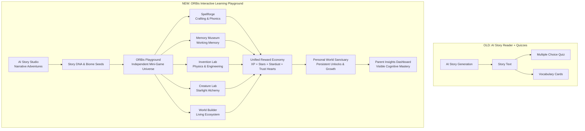
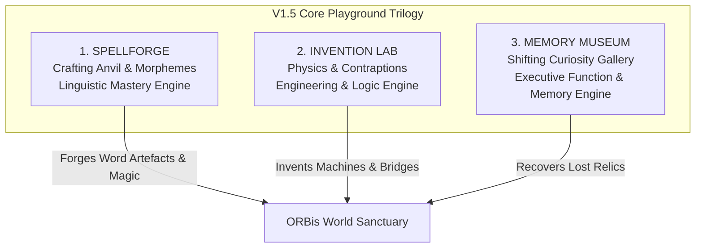
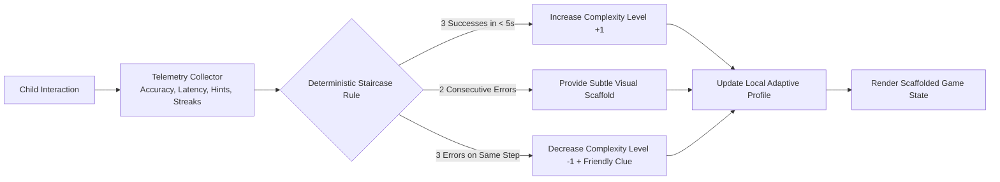
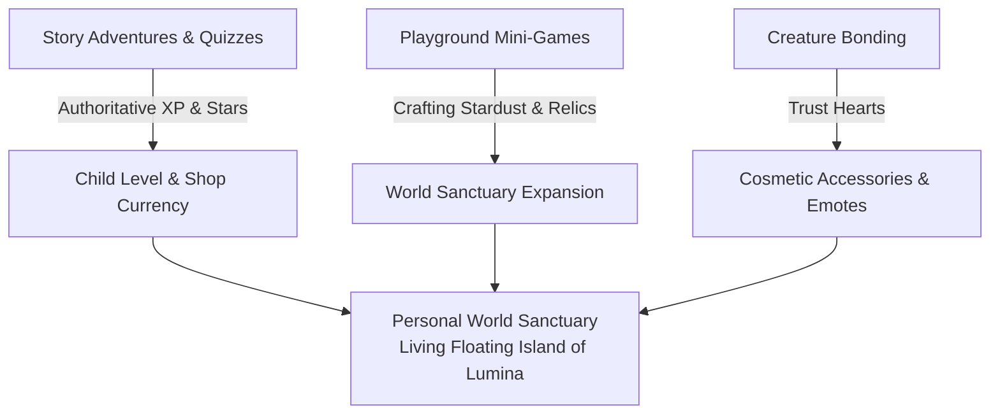
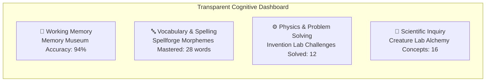

# ORBis Mini-Game Design System & Playground Architecture

> **Document Version:** 1.0.0 (V1.5 Blueprint)  
> **Status:** Active Product & Game Design Specification  
> **Philosophy:** *Fun Before Learning — A magical animated learning playground where children return because the activities themselves are intrinsically delightful.*  
> **Cost Invariant:** 100% Deterministic Local Client Execution ($0.00 Runtime AI Cost)  
> **Security & Economy Invariant:** Server-Authoritative Supabase RPC (`award_child_rewards`) & Persistent Ledger (`child_activity_rewards`)

---

## 1. Product Transformation & Core Vision

ORBis is evolving from an **AI story generator with educational quizzes attached** into a **unified magical learning playground**. 



### The 6 Core Pillars for Parent Value
1. **AI-Personalized Learning Experiences:** Dynamic story adventures that seed characters and vocabulary into real playable games.
2. **Beautiful Animated World Children Love:** Tactile, organic, living environments that respond to child interaction.
3. **Growing Collection of Original Mini-Games:** Mechanically diverse, non-quiz interactive systems (crafting, deduction, physics, chemistry, ecology).
4. **Deterministic Adaptive Difficulty:** A self-scaffolding engine that responds to accuracy, latency, and mastery without frustration.
5. **Visible Cognitive Milestones for Parents:** Transparent skill taxonomy (Memory, Vocabulary, Comprehension, Logic, Creativity, Phonics).
6. **Persistent Magical Progression:** Unlocks living creatures, sanctuary biomes, and architectural elements through effort.

---

## 2. The 7 Mini-Game Design Principles

Every ORBis mini-game adheres to these strict experience standards:

### 1. Fun BEFORE Learning
The child must understand the toy-like fun mechanic in the first 5 seconds. Learning happens naturally as the primary gameplay verb, never as a pop-up quiz interrupting play.

### 2. The 20-Second Fun Loop
$$\text{Challenge Visualized} \rightarrow \text{Physical/Tactile Action} \rightarrow \text{Immediate Multi-Sensory Feedback} \rightarrow \text{Positive Micro-Reward}$$
A complete cycle completes in 20–30 seconds, maintaining flow state and allowing natural exit or replay points.

### 3. Deep Replayability via Procedural Variation
No static, one-and-done game boards. Every session dynamically configures:
- Seeded combinations & target challenges
- Dynamic difficulty scaling
- Environmental and atmospheric modifiers
- Collectible discovery lore & cosmetic variations

### 4. Strong Tactile Visual Identity
Games must NOT look like generic SaaS web cards or flat white forms. They feel like **animated physical toys, magical contraptions, and miniature living dioramas** with layered depth, soft gradients, and fluid inertia.

### 5. Immediate Multi-Sensory Feedback
Every touch produces a cascade of organic feedback:
- Squash-and-stretch scale transforms
- Synthesized Web Audio harmonics ([`sfxService.ts`](file:///c:/Users/muhammad/WonderTalesAI/src/services/audio/sfxService.ts))
- Particle bursts and environmental glows
- Delightful character reactions

### 6. Safe & Encouraging Failure ("Happy Accidents")
Children are never penalized with harsh buzzers, red crosses, or "Game Over" screens. Incorrect actions trigger funny physical reactions, gentle clues (*"Almost! Let's try combining the cool water next!"*), and crafting stardust.

### 7. Universal Accessibility Standards
- **Hardware:** Touch, mouse, and full keyboard navigation (Tab/Arrow keys/Number shortcuts).
- **Sensory:** Strict WCAG AAA color contrast, scalable typography, and `prefers-reduced-motion` fallbacks.
- **Physical:** Minimum 44px–48px touch targets.
- **Cognitive:** Polite `aria-live` screen-reader narration of game state.

---

## 3. Detailed Specifications for 10 Original ORBis Mini-Games

---

### Game 1: SPELLFORGE (Magical Component Crafting)

```
+-------------------------------------------------------------------+
|  🔥 SPELLFORGE: Rune Anvil                     [⭐ 15]  [✨ 40]   |
|                                                                   |
|              [  B  ]  [  U  ]  [ T T ]  [ E R ]  [ F L Y ]        |
|                  \       |        |        /        /             |
|                   +------+--------+-------+--------+              |
|                                                                   |
|                      +------------------------+                   |
|                      |  [B][U][T][T][E][R][F][L][Y] |             |
|                      +------------------------+                   |
|                                  ||                               |
|                         (  GLOWING ANVIL  )                       |
|                                                                   |
|  [🔨 STRIKE FORGE!]                                               |
+-------------------------------------------------------------------+
```

- **Primary Cognitive Domain:** `vocabulary` & `phonics`
- **Secondary Skills:** Orthography, Morphology (Prefixes, Roots, Suffixes), Fine Motor Sequencing.
- **Age Suitability:** Ages 4–10 (Dynamic chunking from single letters to syllabic morphemes).
- **Core Gameplay Loop:**
  $$\text{Inspect Target Rune Blueprint} \rightarrow \text{Forge Glowing Letter Chunks onto Anvil} \rightarrow \text{Strike Hammer to Activate} \rightarrow \text{Spell Awakens into Living Entity}$$
- **Why Voluntary Replay:** Words are not just typed; they are *magically crafted*. Forging `"B-U-T-T-E-R-F-L-Y"` ignites the anvil in golden sparks, assembling a real animated butterfly that flutters into the child's world sanctuary!
- **30-Second Example:** The blueprint shows a sleeping sapling. Floating crystal runes `[S]`, `[P]`, `[R]`, `[O]`, `[U]`, `[T]` float around the forge. Child drags them into the heated slots, taps "Strike Forge!" $\rightarrow$ Golden hammer sparks ignite the word and a living sprout pops up with a joyful chirp!
- **3-Minute Example:** A 3-tier master forge challenge: Round 1 crafts the base word `[LIGHT]`; Round 2 attaches the prefix `[SUN] + [LIGHT]`; Round 3 crafts a compound spell `[SUN] + [LIGHT] + [NING]` to summon a majestic solar storm beast.
- **Reward Structure:** Unlocks new anvil metals (Star-Gold, Moon-Silver), hammer styles, and creates permanent cosmetic wildlife for World Builder.
- **Deterministic Zero-Cost Engine:** Local dictionary prefix tree (Trie) and morpheme lookup tables ($0.00 AI cost).

---

### Game 2: MEMORY MUSEUM (The Shifting Curiosity Gallery)

```
+-------------------------------------------------------------------+
|  🏛️ MEMORY MUSEUM: Hall of Curiosities         [Time: 3s]          |
|                                                                   |
|    +---------------+  +---------------+  +---------------+        |
|    |  [👑 Crown]   |  | [🏺 Urn]      |  | [🔭 Telescope]|        |
|    +---------------+  +---------------+  +---------------+        |
|                                                                   |
|    +---------------+  +---------------+  +---------------+        |
|    | [💎 Crystal]  |  |  [🗝️ Key]     |  | [🦉 Golden Owl]|       |
|    +---------------+  +---------------+  +---------------+        |
|                                                                   |
|  *Curtain Drops for 1.5s... Museum Shifts!*                       |
|  "Which artifact swapped places with the Golden Owl?"            |
+-------------------------------------------------------------------+
```

- **Primary Cognitive Domain:** `memory`
- **Secondary Skills:** Visual Search, Spatial Orientation, Working Memory Updating, Inhibitory Focus.
- **Age Suitability:** Ages 4–11.
- **Core Gameplay Loop:**
  $$\text{Observe Museum Pedestals (3-5s)} \rightarrow \text{Curtain Drops / Lights Flicker} \rightarrow \text{Museum Shifts} \rightarrow \text{Identify What Disappeared / Moved / Changed}$$
- **Why Voluntary Replay:** Children love the tactile intrigue of being a museum curator solving optical mysteries. Every room has whimsical artifacts (floating hourglasses, ticking clocks, glowing eggs) that animate.
- **30-Second Example:** 4 pedestals display an Apple, a Crown, a Star, and a Key. Lights dim for 1 second. When they turn on, the Key is gone and a Feather is in its place. Child taps the Feather: *"Aha! The Feather is the sneaky newcomer!"* Confetti burst and +25 XP awarded!
- **3-Minute Example:** A multi-room expedition through the *Clockwork Wing*: Round 1 (Disappearance), Round 2 (Spatial Position Swap), Round 3 (Color/State Change: the owl opened its eyes).
- **Reward Structure:** Museum Curator Badges, Artifact Lore Cards, Display Pedestals for World Builder.
- **Deterministic Zero-Cost Engine:** Pure array permutation algorithms and seeded object coordinate matrices ($0.00 cost).

---

### Game 3: WORD DETECTIVE (Forensic Contextual Deduction)

- **Primary Cognitive Domain:** `comprehension` & `logic`
- **Secondary Skills:** Contextual Vocabulary Inference, Forensic Evaluation, Deductive Elimination.
- **Age Suitability:** Ages 5–11.
- **Core Gameplay Loop:**
  $$\text{Receive Detective Mystery} \rightarrow \text{Examine 3 Clue Footprints / Sounds / Objects} \rightarrow \text{Cross-Examine Suspect Pool} \rightarrow \text{Deduce Target Word / Concept}$$
- **Why Voluntary Replay:** Children feel like brilliant investigators. Instead of answering flashcards, they use magnifying glasses to inspect interactive scenes and rule out false suspects.
- **30-Second Example:** Mystery: *"Find the nocturnal pollinator."* Clue 1: *Leaves behind glowing pollen.* Clue 2: *Sleeps during bright daylight.* Clue 3: *Has soft velvet wings.* Child eliminates Sun-Beetle and Hawk, selecting the *Moon-Moth*!
- **3-Minute Example:** A 4-stage forensic case across the *Enchanted Library*: finding who borrowed the Ancient Star Map by analyzing footprint sizes, bookmark symbols, and ink stains.
- **Reward Structure:** Detective Magnifying Glasses, Case Files, Forensic Badges.
- **Deterministic Zero-Cost Engine:** Seeded relational matrices and constraint elimination algorithms ($0.00 cost).

---

### Game 4: SKYSHIP BUILDER (Spatial Logic & Route Engineering)

- **Primary Cognitive Domain:** `logic` & `spatial_physics`
- **Secondary Skills:** Algorithmic Sequencing, Predictive Path Planning, Resource Management.
- **Age Suitability:** Ages 5–11.
- **Core Gameplay Loop:**
  $$\text{Survey Floating Island Archipelago} \rightarrow \text{Place Wind Ramps, Cloud Bridges & Boost Crystals} \rightarrow \text{Launch Skyship} \rightarrow \text{Navigate Hazards to Beacon}$$
- **Why Voluntary Replay:** The thrilling physics simulation of watching their custom-designed airway launch a little wooden skyship through air currents, bouncing off cloud cushions and collecting sky gems.
- **30-Second Example:** Skyship must reach a high floating lighthouse. Child places an Updraft Fan on Tile 2 and a Cloud Bouncer on Tile 4. Taps "Launch!" $\rightarrow$ Ship catches the breeze, bounces softly, and lands at the lighthouse beacon!
- **3-Minute Example:** Navigating a storm archipelago with crosswinds and floating mines: child rations 4 track tiles, calculates wind drift, and creates a curved aerial route that scoops up 3 star coins before docking.
- **Reward Structure:** Custom Skyship Hulls, Sail Patterns, Sky Beacon Trophies.
- **Deterministic Zero-Cost Engine:** 2D grid waypoint physics simulation ($0.00 cost).

---

### Game 5: CREATURE CARE LAB (Ethology & Empathy Simulation)

- **Primary Cognitive Domain:** `creativity` & `comprehension`
- **Secondary Skills:** Social-Emotional Intelligence, Biological Needs, Observational Diagnosis, Cause-and-Effect.
- **Age Suitability:** Ages 3–9.
- **Core Gameplay Loop:**
  $$\text{Receive Ailing / Playful Creature} \rightarrow \text{Diagnose Non-Verbal Emotional Cues} \rightarrow \text{Prepare Sanctuary Habitat & Diet} \rightarrow \text{Bond via Tactile Mini-Games} \rightarrow \text{Earn Trust Hearts}$$
- **Why Voluntary Replay:** Tamagotchi-style emotional connection. Hatched creatures from *Creature Lab* have distinctive behaviors, sleep cycles, and favorite melodies.
- **30-Second Example:** *Glow-Puff* is shivering and holding its tummy. Child diagnoses cold and hunger: feeds it a warm Solar Berry and wraps it in a leafy blanket. Glow-Puff purrs loudly and emits a shower of glowing Trust Hearts!
- **3-Minute Example:** Designing a multi-zone habitat for an energetic *Storm-Pegasus*: crafting an electrified cloud bed, harvesting Raindrop Berries from the garden, and playing a rhythmic harmony on the Starlight Harp.
- **Reward Structure:** Creature Hats & Accessories, Companion Emotes, Friendship Level-Ups.
- **Deterministic Zero-Cost Engine:** Finite State Machine (FSM) tracking creature satisfaction vectors locally ($0.00 cost).

---

### Game 6: RHYTHM SPELLS (Auditory Patterning & Musical Phonics)

- **Primary Cognitive Domain:** `phonics` & `memory`
- **Secondary Skills:** Auditory Discrimination, Syllabic Stress, Mathematical Fractions, Pattern Completion.
- **Age Suitability:** Ages 4–10.
- **Core Gameplay Loop:**
  $$\text{Listen to Magical Beat & Syllable Pattern} \rightarrow \text{Tap / Echo Rhythm on Pentatonic Runes} \rightarrow \text{Complete Missing Rhythmic Measure} \rightarrow \text{Unleash Musical Light Cascade}$$
- **Why Voluntary Replay:** Irresistible musical groove. Quantized to harmonious pentatonic scales so every tap creates broadcast-quality music and synchronized light ripples.
- **30-Second Example:** Forest Sprites tap a 3-beat rhythm: *Ta - Ta - Ti-Ti*. Child taps the glowing mushroom drums in exact sync. A golden wave of sound sweeps the pond, causing water lilies to bloom!
- **3-Minute Example:** Syllable beat battle: Sprites chant 3-syllable creature names (`"E-LE-PHANT"`, `"BUT-TER-FLY"`). Child taps out the syllabic stress patterns on rhythm stones to charge a Starlight Symphony.
- **Reward Structure:** Musical Instruments (Harp, Flute, Earth Drums), Soundfont Packs, Maestro Badges.
- **Deterministic Zero-Cost Engine:** Web Audio API precise micro-step scheduling ($0.00 cost).

---

### Game 7: WORLD BUILDER (The Ecological Sandbox)

- **Primary Cognitive Domain:** `creativity` & `logic`
- **Secondary Skills:** Systems Thinking, Environmental Ecology, Spatial Layout, Botany.
- **Age Suitability:** Ages 4–12.
- **Core Gameplay Loop:**
  $$\text{Survey Empty Floating Island} \rightarrow \text{Place Terrain, Rivers, Shrines & Flora} \rightarrow \text{Observe Ecological Chain Reactions} \rightarrow \text{Hatch / Welcome Wildlife} \rightarrow \text{Harvest Stardust}$$
- **Why Voluntary Replay:** The ultimate creative sandbox. The child is the benevolent architect of their own permanent world. Trees produce shade, rivers carve meadows, and creatures build nests.
- **30-Second Example:** Child places a Glacial Spring tile next to dry soil. Water flows downhill, grass sprouts across 3 tiles, and two Sproutlings hop over to drink, dropping +5 Stardust.
- **3-Minute Example:** Constructing a complete *Sunlit Meadow Valley*: building a stepped waterfall, planting Whisper Trees, balancing moisture levels, and fulfilling habitat conditions to attract a Rare *Glow-Deer*.
- **Reward Structure:** Biome expansions (Lava Forge, Cloud Citadel, Crystal Abyss), architectural props, sanctuary upgrades.
- **Deterministic Zero-Cost Engine:** 2D cellular automata grid rules on an interactive isometric canvas ($0.00 cost).

---

### Game 8: TIME MACHINE (Causal Sequencing & Chronology)

- **Primary Cognitive Domain:** `comprehension` & `logic`
- **Secondary Skills:** Narrative Chronology, Historical Eras, Cause-and-Effect Prediction, Scientific Life Cycles.
- **Age Suitability:** Ages 5–11.
- **Core Gameplay Loop:**
  $$\text{Step into Chrono-Dial} \rightarrow \text{Inspect Scrambled Past / Present / Future Events} \rightarrow \text{Reconstruct True Causal Timeline} \rightarrow \text{Watch World Evolve in Smooth Animation}$$
- **Why Voluntary Replay:** Children love scrubbing the timeline slider back and forth to watch a tiny seed sprout into a giant tree, or an ancient ruin assemble itself back into a sparkling palace.
- **30-Second Example:** Life cycle of a frog: Child arranges 3 timeline cards: `[Eggs in Pond] -> [Tadpole Swimming] -> [Frog on Lilypad]`. Sliding the time lever animates the transformation smoothly!
- **3-Minute Example:** A 5-step geological riddle: reconstructing how a volcanic eruption formed a fertile island, cooled into black obsidian rocks, gathered rainfall, sprouted rainforests, and became a sanctuary.
- **Reward Structure:** Time Chronometers, Historical Relic Cards, Time Traveler Badges.
- **Deterministic Zero-Cost Engine:** Pure deterministic topological sorting and causal DAG validation ($0.00 cost).

---

### Game 9: INVENTION LAB (Physics Puzzles & Rube Goldberg Contraptions)

```
+-------------------------------------------------------------------+
|  ⚙️ INVENTION LAB: "Help the Sproutling Cross"   [Toolbox: 4/4]    |
|                                                                   |
|   (Sproutling)                                                   |
|       [🌱]                                                       |
|       \___/                                                      |
|           \                                     [🎯 Target Goal]  |
|            \      [ 🧲 Magnet ]                 |==============|  |
|             \           |                                         |
|              \=== [ 🌀 Springboard ] ===>                         |
|                                                                   |
|  +-------------------------------------------------------------+  |
|  | [🧲 Magnet] | [🌀 Spring] | [🪢 Rope] | [💨 Blower] | [🪵 Ramp] |  |
|  +-------------------------------------------------------------+  |
|  [▶️ TEST INVENTION!]                                              |
+-------------------------------------------------------------------+
```

- **Primary Cognitive Domain:** `logic` & `creativity`
- **Secondary Skills:** Mechanical Intuition, Physics Reasoning (Gravity, Momentum, Magnetism, Elasticity), Iterative Design.
- **Age Suitability:** Ages 5–12.
- **Core Gameplay Loop:**
  $$\text{Observe Physics Obstacle} \rightarrow \text{Select Components (Springs, Magnets, Blowers, Ramps)} \rightarrow \text{Assemble Contraption} \rightarrow \text{Press Play to Simulate} \rightarrow \text{Iterate & Succeed}$$
- **Why Voluntary Replay:** Pure *Incredible Machine* creative problem-solving delight. Failure is hilarious (the character bounces off a cloud cushion), and finding clever alternate solutions is deeply empowering.
- **30-Second Example:** A Sproutling needs to cross a gap. Child places a tilted Wooden Ramp and a Bouncy Springboard at the bottom. Taps "Test!" $\rightarrow$ Sproutling slides down, bounces high over the gap, and lands safely with a cheer!
- **3-Minute Example:** A multi-stage contraption: A rolling marble hits a switch, turning on a fan that blows a balloon up to trigger a magnet, pulling down a drawbridge for a baby dragon to cross.
- **Reward Structure:** Golden Cogwheels, Blueprint Schemes, Master Inventor Goggles.
- **Deterministic Zero-Cost Engine:** 2D Verlet / Impulse-based physics engine on HTML5 Canvas ($0.00 cost).

---

### Game 10: ORBIS QUEST RUN (Active Narrative Adventure Runner)

- **Primary Cognitive Domain:** `comprehension`, `memory` & `logic`
- **Secondary Skills:** Rapid Classification, Pattern Recognition, Executive Decision Making.
- **Age Suitability:** Ages 5–11.
- **Core Gameplay Loop:**
  $$\text{Embark on Side-Scrolling Adventure} \rightarrow \text{Encounter Narrative Fork / Micro-Challenge} \rightarrow \text{Solve Quick Puzzle (Sort, Trace, Deduce)} \rightarrow \text{Unlock Path & Continue Journey}$$
- **Why Voluntary Replay:** Combines the exciting kinetic momentum of an animated platformer with frictionless micro-learning checkpoints that make the child feel like a legendary hero.
- **30-Second Example:** Hero runs through the Crystal Caves. A stone gate blocks the way with 3 glowing glyphs. Hero must tap the glyph that rhymes with *"STAR"* (`[CAR]`). Gate opens in a burst of light and hero leaps through!
- **3-Minute Example:** A full 3-zone quest through *The Sky Citadel*: Zone 1 requires sorting elemental gems; Zone 2 requires memorizing a 4-step light path across a floating bridge; Zone 3 requires solving a riddle to befriend the Sky Guardian.
- **Reward Structure:** Hero Outfits, Adventure Crests, Explorer Badges.
- **Deterministic Zero-Cost Engine:** 2D frame-based parallax runner with embedded micro-challenge state machines ($0.00 cost).

---

## 4. Multi-Criteria Ranking & Selection of the Top 3 for V1.5

### 4.1 Ten-Dimensional Ranking Matrix (1–10 Scale)

| Rank | Mini-Game | Fun | Learn | Replay | Feasib | Visual | Diff | Sub Val | Proced | Prog | Dev Cost | **Total Score** |
| :---: | :--- | :---: | :---: | :---: | :---: | :---: | :---: | :---: | :---: | :---: | :---: | :---: |
| 🥇 **1** | **SPELLFORGE** | 10 | 10 | 10 | 9 | 10 | 10 | 10 | 10 | 10 | 8 | **97 / 100** |
| 🥈 **2** | **INVENTION LAB** | 10 | 10 | 9 | 8 | 10 | 10 | 10 | 9 | 10 | 7 | **93 / 100** |
| 🥉 **3** | **MEMORY MUSEUM** | 9 | 9 | 10 | 10 | 9 | 9 | 9 | 10 | 9 | 9 | **93 / 100** |
| 4 | **World Builder** | 10 | 9 | 10 | 6 | 10 | 10 | 10 | 8 | 10 | 6 | **89 / 100** |
| 5 | **Creature Lab** *(M1/M2 Done)* | 9 | 9 | 9 | 10 | 9 | 9 | 9 | 8 | 9 | 10 | **91 / 100** |
| 6 | **Word Detective** | 9 | 10 | 8 | 9 | 8 | 9 | 9 | 9 | 8 | 8 | **87 / 100** |
| 7 | **Creature Care Lab** | 8 | 8 | 9 | 9 | 8 | 8 | 9 | 8 | 10 | 8 | **85 / 100** |
| 8 | **Skyship Builder** | 9 | 9 | 8 | 7 | 9 | 8 | 8 | 8 | 8 | 7 | **81 / 100** |
| 9 | **Rhythm Spells** | 9 | 8 | 8 | 8 | 8 | 8 | 8 | 9 | 7 | 8 | **81 / 100** |
| 10 | **Time Machine** | 8 | 9 | 7 | 8 | 8 | 8 | 8 | 8 | 8 | 7 | **79 / 100** |
| 11 | **ORBis Quest Run** | 9 | 8 | 8 | 6 | 9 | 7 | 8 | 7 | 8 | 6 | **76 / 100** |

---

### 4.2 The Best 3 Recommendations for V1.5



#### Why These Three?
1. **SPELLFORGE (Linguistic & Creative Domain):** Replaces mundane spelling drills with physical magic crafting. Every word assembled produces a living, animated creature or spell effect.
2. **INVENTION LAB (Engineering & Physics Domain):** Offers unparalleled emergent problem-solving. Children experiment with springs, magnets, and blowers in a sandbox that makes STEM feel like pure play.
3. **MEMORY MUSEUM (Executive Working Memory Domain):** Replaces generic card-matching with an immersive spatial mystery that dynamically alters room objects.

*(Note: **Creature Lab** Milestone 2 is already complete and forms the fourth playable anchor of the playground).*

---

## 5. Reusable Playground Architecture & Contracts

### 5.1 Directory Structure

```text
src/
 ├── types/
 │    └── playground.ts                 <-- Formal game contracts, difficulty & progression
 ├── services/
 │    └── games/
 │         ├── playgroundRegistry.ts    <-- Scalable registry & metadata catalog
 │         ├── spellforgeEngine.ts      <-- Deterministic Trie & word crafting logic
 │         ├── inventionLabEngine.ts    <-- 2D physics simulation & component library
 │         ├── memoryMuseumEngine.ts    <-- Procedural room generation & state shifts
 │         └── creatureLabEngine.ts     <-- (Existing) Starlight alchemy engine
 ├── components/
 │    ├── experience/                   <-- (Existing) ActivityShell, RewardCelebration, SFX
 │    └── playground/
 │         ├── PlaygroundHub.tsx        <-- Main magical game discovery dashboard
 │         ├── PlaygroundHUD.tsx        <-- Universal header (Stardust, Badges, Audio)
 │         ├── AdaptiveDifficultyBadge.tsx
 │         ├── spellforge/
 │         ├── invention-lab/
 │         └── memory-museum/
 └── pages/
      ├── PlaygroundPage.tsx            <-- Mounted at /playground (and /games)
      ├── SpellforgePage.tsx            <-- /playground/spellforge
      ├── InventionLabPage.tsx          <-- /playground/invention-lab
      └── MemoryMuseumPage.tsx          <-- /playground/memory-museum
```

---

### 5.2 The Adaptive Difficulty Engine Contract



---

## 6. Persistent Progression & Reward Model



- **Zero-Gamble Unlocks:** No loot boxes or randomized gacha. All unlocks are transparently earned through effort milestones.
- **Crafting Stardust Economy:** 10 Stardust per new discovery, 3 Stardust per repeat mastery play, 5 Stardust for happy accidents.

---

## 7. Parent Insights Value Model



Parents view genuine cognitive milestones (e.g., *"Leo mastered prefixes 'UN-' and 'RE-' today in Spellforge"*) rather than predatory screen-time counters.

---

## 8. Premium Monetization Strategy (Future Plan)

| Feature Pillar | Free Tier (Always Complete) | Premium Plan (Future Subscription) |
| :--- | :--- | :--- |
| **Story Creation** | 3 AI Stories / month + rotating library | Unlimited AI Story Generation + Custom Characters |
| **Playground Games** | 4 Core Games (`Creature Lab`, `Spellforge Tier 1`, `Memory Museum Tier 1`, `Story Quests`) | All 10 Mini-Games + Master Difficulty Tiers |
| **World Sanctuary** | 1 Starter Island (*Sunlit Clearing*) | 6 Floating Biomes (*Cloud Citadel, Lava Forge, Crystal Abyss*) |
| **Audio & Narration** | Local Synthesized Voices (Piper/WebAudio) | Studio Cloud AI Narration across 10 Languages |
| **Parent Dashboard** | Weekly High-Level Summary | Deep Real-Time Cognitive Analytics & Skill Recommendations |

---

## 9. Visual & Sound Direction

- **Lighting & Materiality:** Deep indigo/slate cosmic backdrops (`#0f172a` to `#1e1b4b`) accented with radiant glowing glyphs, golden amber heat, and luminous cyan fluids.
- **Physicality:** All buttons, tiles, and components feature 3D depth offsets (`transform: translateY(2px)` on active press), soft drop shadows, and responsive particle bursts.
- **Audio:** Layered synthetic Web Audio cues (harmonic arpeggios, bubble pops, brass fanfares, metallic anvil chimes) designed for zero-latency instant feedback.
