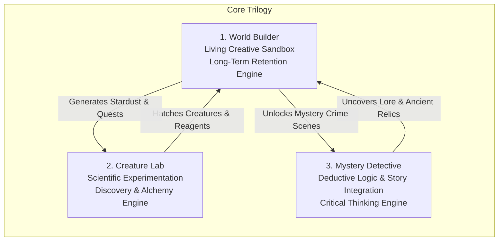
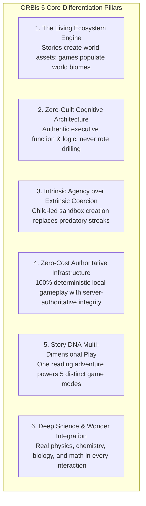
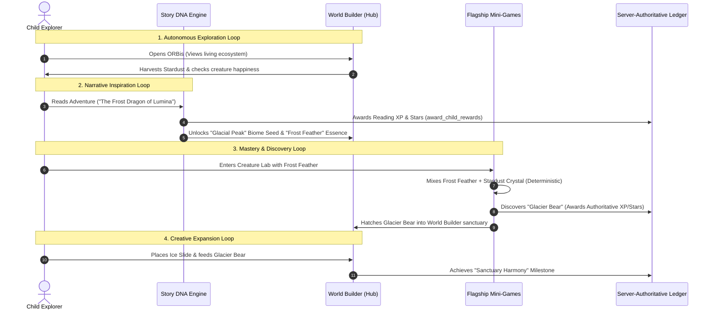
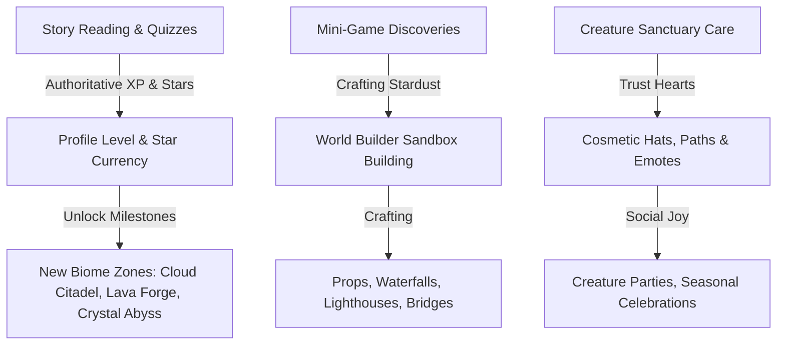
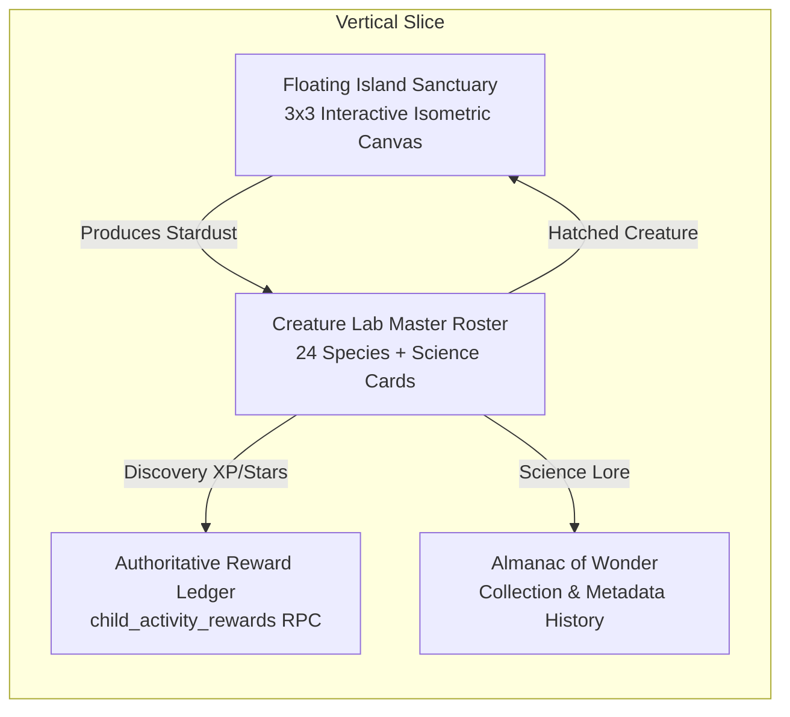
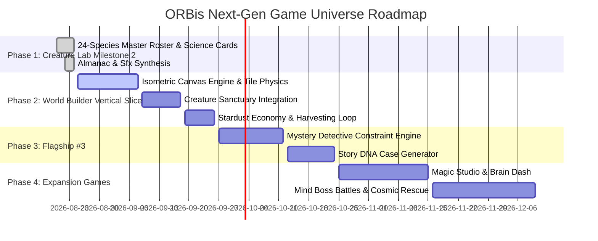

# ORBis Next-Generation Mini-Game & Product Differentiation Research Brief

> **Document Class:** Research & Product Architecture Blueprint  
> **Status:** Strategic Reference Document  
> **Cost Invariant:** 100% Deterministic Local Client Execution ($0.00 Runtime AI Cost)  
> **Security & Economy Invariant:** Server-Authoritative Supabase RPC (`award_child_rewards`) & Persistent Ledger (`child_activity_rewards`)

---

## Executive Summary

ORBis is evolving from an **AI-assisted story generator with attached educational quizzes** into a **magical, living interactive learning universe**. In this universe, stories are one vital pillar, but children return autonomously because the world itself is dynamic, tactile, creative, and intrinsically rewarding.

This document presents:
1. An in-depth **market & cognitive engagement analysis** across 8 benchmark children's learning products.
2. Complete game design specifications for **10 original ORBis mini-games** engineered around concrete spatial, logical, physics, and creative mechanics (strictly non-flashcard).
3. A rigorous **10-dimensional scoring matrix** identifying the **Top 3 flagship experiences**.
4. The **6 Core Product Differentiators** justifying premium parental investment without relying on superficial buzzwords.
5. The deep architectural design of **World Builder** as ORBis's long-term retention and creative sandbox engine.
6. The unified **Story ↔ World ↔ Game ecosystem loop**.
7. The minimal **First Vertical Slice** specification and milestone execution roadmap.

---

# Phase 1 — Market Research & Cognitive Engagement Analysis

## 1.1 Competitor Product Analysis

| Product | Core Interaction Pattern | Primary Strength | Critical Limitation / Opportunity for ORBis |
| :--- | :--- | :--- | :--- |
| **Khan Academy Kids** | Guided linear learning path with narrated character guides and discrete mini-lessons. | Clear pedagogical curriculum; highly structured early literacy and math routines. | Feels like digital worksheets/schoolwork; lacks persistent world agency, emergent play, or child-directed sandbox creativity. |
| **Duolingo ABC** | Rapid micro-drills (letter tracing, phoneme tapping, sentence swipe). | High dopamine feedback loops, tight pacing, immediate gratification. | Rigidly linear drill-and-practice; zero world-building; feels gamified rather than playfully immersive. |
| **Endless Alphabet** | Monster puzzle assembly where letters vocalize their phonics sounds when dragged. | Superb tactile kinetic feedback; delightful organic typography and audio synthesis. | Narrow scope (single mechanic repeated); zero overarching world progression or narrative depth. |
| **Lingokids** | Themed arcade mini-games (cooking, sorting, runner) wrapping vocabulary. | Broad variety of casual gameplay loops; high color energy. | Games often feel disconnected from learning (extrinsic trivia tacked onto generic arcade loops); subscription fatigue. |
| **PBS Kids Games** | Narrative mini-games tied to television IPs (Curious George, Wild Kratts). | High emotional connection to familiar characters; strong thematic world integration. | Fragmented standalone web experiences without unified progression, cognitive tracking, or personalized growth. |
| **ScratchJr** | Visual block-based programming sandbox where kids animate characters. | Supreme child agency and creative expression; authentic computational thinking. | Steep learning curve for pre-readers; lacks structured narrative pacing or intrinsic motivation systems for casual play. |
| **Pok Pok** | Open-ended digital Montessori playroom (busy boards, marble runs, drawing pads). | Calm, non-addictive, zero-text exploration; respect for child attention. | Completely unstructured; lacks guided mastery, storytelling, reading connection, or parent-visible learning milestones. |
| **Toca Boca (Life World)** | Dollhouse sandbox simulation where children orchestrate emergent character stories. | Ultimate open-ended roleplay and environmental reactivity. | No intentional cognitive/academic curriculum; heavy microtransaction-driven monetization model. |

---

## 1.2 Identified Reusable Engagement Principles

From this research, ORBis extracts 12 fundamental engagement principles for children’s interactive systems:

```mermaid
graph TD
    A[Core Engagement Engine] --> B[Intrinsic Play Loop]
    A --> C[Cognitive Progression]
    A --> D[Agency & Identity]

    B --> B1[Tactile Kinetic Delight: 60fps organic physics]
    B --> B2[Micro-Challenge Pacing: 30s-3m loops]
    B --> B3[Meaningful Multi-Sensory Feedback: synthetic audio & particle bursts]
    B --> B4[Zero-Penalty Experimentation: Happy accidents over failure screens]

    C --> C1[Emergent Cognitive Mastery: Problem solving via game mechanics]
    C --> C2[Adaptive Difficulty: Dynamic scaffolding without friction]
    C --> C3[Exploration & Collection: Non-coercive curiosity triggers]
    C --> C4[Curriculum-Mechanic Harmony: Learning IS the gameplay]

    D --> D1[Personal World Ownership: Modifying a living ecosystem]
    D --> D2[Story-World Continuity: Story assets come alive in games]
    D --> D3[Creative Personalization: Custom naming, coloring, arranging]
    D --> D4[Parent-Child Pride Bridge: Observable cognitive milestones]
```



1. **Tactile Kinetic Delight:** Every drag, drop, press, and collision must have physical presence—bounciness, squash-and-stretch, fluid inertia, and rich Web Audio resonance.
2. **Micro-Challenge Pacing:** Complete discrete game interactions in **30 to 90 seconds**, with optional deep play extending up to **3 to 5 minutes**.
3. **Curriculum-Mechanic Harmony:** The academic/cognitive skill *must be the primary gameplay verb* (e.g., balance weights to cross a bridge, route water to grow crops), NOT a multiple-choice pop-up interrupting a runner.
4. **Zero-Penalty Experimentation:** Replace "Game Over" and red crossbars with **"Happy Accidents"**, funny physical reactions, and emergent surprises.
5. **Living World Ownership:** Children do not just earn numbers; they earn physical elements (sprouts, watercourses, creature dens, stars) that transform their persistent world.
6. **Cross-Domain Story Continuity:** Characters, artifacts, and vocabulary met in reading adventures materialize as interactable entities in the mini-game world.

---

## 1.3 ORBis Market Opportunity Space

Where every other app forces a trade-off between **Rigid Curriculum Worksheets** (Khan Kids) vs. **Pure Unstructured Sandbox** (Toca Boca/Pok Pok), ORBis occupies the uncontested blue ocean:

$$\mathbf{ORBis} = \mathbf{Story\ Imagination} + \mathbf{Emergent\ Game\ Physics} + \mathbf{Living\ World\ Sandbox} + \mathbf{Authoritative\ Cognitive\ Growth}$$

---

# Phase 2 — Detailed Design of 10 Original ORBis Mini-Games

---

### Game 1: World Builder (The Ecological Sandbox)

- **Primary Cognitive Skills:** Spatial Reasoning, Systems Thinking, Environmental Ecology, Cause-and-Effect Modeling.
- **Secondary Learning Skills:** Resource Planning, Botany Basics, Water Cycle Dynamics, Fine Motor Precision.
- **Age Suitability:** Ages 4–10 (Self-scaffolding complexity).
- **Core Gameplay Loop:** 
  $$\text{Survey Biome Tile} \rightarrow \text{Place Terrain / Water / Flora} \rightarrow \text{Observe Environmental Reaction} \rightarrow \text{Attract Wildlife} \rightarrow \text{Harvest Stardust / Bio-Essence}$$
- **Why a Child Voluntarily Replays:** The world is living and dynamic. Placing water next to dry soil grows moss; placing sun flowers next to moss attracts fireflies. The child feels like the benevolent creator of an ever-expanding magical ecosystem.
- **30-Second Gameplay Slice:** The child drags a "Glacial Spring" tile onto a cracked volcanic rock. The spring thaws, cutting a gentle blue stream across three tiles. Two wild Sproutlings hop over to drink, bubbling with happiness and dropping 5 Crafting Stardust.
- **3-Minute Gameplay Slice:** The child designs a complete "Sunlit Meadow Valley". They construct a terraced waterfall using rock ledges, plant a cluster of Whisper Trees along the bank, balance moisture levels, and successfully meet the habitat criteria to hatch a Rare *Glow-Deer*.
- **Difficulty Progression:**
  - *Novice (Age 4-5):* 2x2 grid, direct 1-to-1 interactions (Water + Dirt = Flowers).
  - *Explorer (Age 6-7):* 4x4 isometric terrain, elevation flow (water runs downhill), predator/pollinator harmony.
  - *Architect (Age 8-10):* Multi-layered micro-climates, temperature balancing, energy networks powering ancient starlight shrines.
- **Reward Structure:** Unlocks new biome terrain tiles, decorative props, and persistent creature visits. Grants authoritative XP and Stars on milestone biome stability.
- **Connection to ORBis World:** Acts as the central persistent world hub where all story characters, hatched creatures, and earned cosmetics reside.
- **Zero-AI Runtime Engine:** Deterministic cellular automata grid rules executed purely in TypeScript on a 2D canvas/isometric renderer ($0.00 cost).
- **Future AI Synergy:** Story generation can output unique "Biome Seeds" (e.g., "The Crystal Marshlands of Chapter 3") that configure initial world templates without per-interaction LLM dependencies.
- **Technical Complexity & Effort:** High (3.5–4 weeks).

---

### Game 2: Potion Lab / Alchemical Discovery (State-Change Chemistry)

- **Primary Cognitive Skills:** Hypothesis Testing, Scientific Method, Categorization, Inductive Reasoning.
- **Secondary Learning Skills:** States of Matter (Solid, Liquid, Gas), Heat Dynamics, Color Theory, Measurement.
- **Age Suitability:** Ages 4–9.
- **Core Gameplay Loop:**
  $$\text{Inspect Target Clue} \rightarrow \text{Select 2-3 Base Reagents} \rightarrow \text{Adjust Heat / Agitation} \rightarrow \text{Observe State Transformation} \rightarrow \text{Discover Compound / Creature}$$
- **Why a Child Voluntarily Replays:** Pure tactile alchemy. Watching liquids change viscosity, bubble, freeze into crystals, or evaporate into rainbow mist triggers deep sensory curiosity.
- **30-Second Gameplay Slice:** Child selects *Moon Dew* + *Sun Ember*, places burner on "Warm", and stirs. Liquid shifts from indigo to glowing amber, releasing steam bubbles that pop into a cheerful *Glow-Puff*.
- **3-Minute Gameplay Slice:** Child works through an ancient alchemical riddle in the Almanac requiring a 3-stage distillation: melt a Stardust Crystal, cool it with Breeze Feathers to form liquid vapor, and condense it into a flask to reveal the Legendary *Astral Elixir*.
- **Difficulty Progression:**
  - *Tier 1:* Binary ingredient pairing (Color & Element matching).
  - *Tier 2:* Temperature modulation (Freezing, Melting, Vaporizing).
  - *Tier 3:* Precise ratio balancing and catalytic timing.
- **Reward Structure:** Unlocks new reagents, flask glassware styles, and fills the master Almanac of Discovery with science cards.
- **Zero-AI Runtime Engine:** Commutative hash-table lookup matching sorted arrays of reagent IDs and thermodynamic states ($0.00 cost).
- **Technical Complexity & Effort:** Medium (Already established in Creature Lab Milestone 2, expandable to advanced physical state machines in 1.5 weeks).

---

### Game 3: Mystery Detective (Constraint-Satisfaction Deduction)

- **Primary Cognitive Skills:** Deductive Reasoning, Working Memory, Constraint Satisfaction, Spatial Logic.
- **Secondary Learning Skills:** Evidence Evaluation, Text/Icon Comprehension, Vocabulary in Context.
- **Age Suitability:** Ages 5–11.
- **Core Gameplay Loop:**
  $$\text{Read / Hear Case Clues} \rightarrow \text{Inspect Scene Suspects & Locations} \rightarrow \text{Eliminate Impossibilities} \rightarrow \text{Assemble True Sequence} \rightarrow \text{Solve Mystery}$$
- **Why a Child Voluntarily Replays:** Children love the empowerment of being the smartest detective in the room. The "Aha!" moment of ruling out suspects with absolute certainty feels deeply satisfying.
- **30-Second Gameplay Slice:** Clue: *"The creature who ate the golden berry has wings, but does NOT like water."* Child inspects 3 suspects (Duck, Dragon, Dolphin), taps the cross on Duck and Dolphin, and drags the magnifying glass onto the Little Fire-Dragon!
- **3-Minute Gameplay Slice:** A full 3x3 logic grid case: *"Who lost the Star Compass in the Clockwork Tower?"* Child tests 4 interdependent clues across characters, tools, and rooms, systematically checking off false leads on an intuitive, child-friendly tactile deduction board.
- **Difficulty Progression:**
  - *Junior Scout (Ages 5-6):* 1 attribute elimination, visual picture clues, binary choices.
  - *Field Detective (Ages 7-8):* 2x2 grid with relational clues (*"Barnaby was to the left of the baker"*).
  - *Master Sleuth (Ages 9-11):* 3x3 multi-variable CSP grid with negative logic (*"Neither the owl nor the scarf wearer went to the library"*).
- **Reward Structure:** Detective Badges, Detective Notebook stamps, unique case trophies for the World Builder museum.
- **Connection to ORBis World:** Investigates funny events that occurred inside generated stories or the ORBis universe.
- **Zero-AI Runtime Engine:** Deterministic Constraint Satisfaction Problem (CSP) generator that creates mathematically guaranteed solvable puzzles from seeded combinatorial matrices ($0.00 cost).
- **Technical Complexity & Effort:** Medium (2 weeks).

---

### Game 4: Cosmic Rescue (Orbital Gravity & Trajectory Physics)

- **Primary Cognitive Skills:** Spatial Trajectory Estimation, Predictive Modeling, Timing & Reflex Coordination.
- **Secondary Learning Skills:** Gravitational Pull, Orbital Mechanics, Angles, Momentum & Inertia.
- **Age Suitability:** Ages 5–10.
- **Core Gameplay Loop:**
  $$\text{Observe Target Asteroid} \rightarrow \text{Set Launch Angle & Slingshot Power} \rightarrow \text{Navigate Planetary Gravity Wells} \rightarrow \text{Collect Stardust} \rightarrow \text{Rescue Stranded Starlight Sprite}$$
- **Why a Child Voluntarily Replays:** The juicy, kinetic satisfaction of gravitational slingshots (like *Angry Birds Space* meets *Kerbal Junior*). Watching a starlight ship whip around a massive purple planet and curve into a rescue dock is endlessly thrilling.
- **30-Second Gameplay Slice:** Child pulls back on the Starlight Sling, aiming between two small moons. Releasing fires the capsule; the moon's gravity smoothly bends its flight path into an arc that scoops up 3 space crystals and docks safely at the beacon.
- **3-Minute Gameplay Slice:** A complex sector puzzle with a spinning pulsar and an asteroid belt. Child places a movable "Gravity Anchor" satellite onto the map to warp the flight path safely around space debris, executing a triple-orbit rescue.
- **Difficulty Progression:**
  - *Level 1-5:* Direct line-of-sight slingshot with visual dotted trajectory preview.
  - *Level 6-15:* Static gravity wells bending paths; trajectory preview shortens.
  - *Level 16-30:* Moving orbital bodies, repulsion fields, and fuel/thrust boost pads.
- **Reward Structure:** Cosmic Ship Skins, Space Observatory Star Charts, Cosmic Family essences.
- **Zero-AI Runtime Engine:** 2D Newtonian physics simulation using Verlet integration on HTML5 Canvas ($0.00 cost).
- **Technical Complexity & Effort:** Medium-High (2.5 weeks).

---

### Game 5: Creature Care & Habitat Sanctuary (Ethology & Empathy Simulation)

- **Primary Cognitive Skills:** Emotional Intelligence, Social-Emotional Empathy, Resource Allocation, Habit Formation.
- **Secondary Learning Skills:** Biological Needs (Nutrition, Rest, Play, Hygiene), Animal Behavior, Circadian Rhythms.
- **Age Suitability:** Ages 3–8.
- **Core Gameplay Loop:**
  $$\text{Check Creature Sanctuary} \rightarrow \text{Diagnose Creature Mood & Cues} \rightarrow \text{Prepare Custom Habitat Enrichment} \rightarrow \text{Bond via Grooming/Play} \rightarrow \text{Earn Trust Hearts}$$
- **Why a Child Voluntarily Replays:** Tamagotchi-style emotional bonding. The hatched creatures from *Creature Lab* have distinct personalities, sleep cycles, and favorite songs. Children develop genuine affection for their digital companions.
- **30-Second Gameplay Slice:** Child notices *Glow-Puff* shivering in a dim room. Child drags a warm *Sunstone Hearth* next to its nest and combs its glowing fur with a soft brush. Glow-Puff purrs, curls into a glowing ball, and emits a shower of Trust Hearts.
- **3-Minute Gameplay Slice:** Child designs an enriched habitat for an anxious *Glacier-Bear*: crafting an ice slide, harvesting Star-Melons from the garden, playing a soothing rhythm on the Starlight Harp, and watching the bear transition from shy to playful.
- **Difficulty Progression:**
  - *Toddler/Preschool:* Direct visual prompts (thought bubble shows berry $\rightarrow$ drag berry).
  - *Early Reader:* Interpreting non-verbal creature body language, multi-step care recipes, cross-species habitat compatibility.
- **Reward Structure:** Unlocks creature accessories (scarves, hats), companion emotes, and creature level-ups that unlock new world animations.
- **Zero-AI Runtime Engine:** Finite State Machine (FSM) tracking creature satisfaction vectors locally in React/LocalStorage ($0.00 cost).
- **Technical Complexity & Effort:** Medium (2 weeks).

---

### Game 6: Reality Shift (Topological & Perspective Puzzles)

- **Primary Cognitive Skills:** Mental Rotation, 2D-to-3D Spatial Visualization, Optical Illusion Interpretation.
- **Secondary Learning Skills:** Geometry, Symmetry, Perspective Projection, Coordinate Axes.
- **Age Suitability:** Ages 6–12.
- **Core Gameplay Loop:**
  $$\text{Examine Disconnected Path} \rightarrow \text{Rotate Camera Perspective (90° Shifts)} \rightarrow \text{Align Optical Illusions} \rightarrow \text{Guide Character Across Impossible Bridge}$$
- **Why a Child Voluntarily Replays:** The breathtaking "Monument Valley" magic of seeing two distant pillars align into a continuous bridge when viewed from a different angle. It makes children feel like optical magicians.
- **30-Second Gameplay Slice:** A path is broken by a 10-foot chasm. Child swipes right to rotate the isometric stage 90°. From this new camera angle, the foreground pillar visually overlaps the background tower. The character walks across what appeared to be empty air!
- **3-Minute Gameplay Slice:** A multi-level crystal puzzle where rotating the world switches gravity directions, rolling water droplets down chutes to activate light crystals and open a sanctuary gateway.
- **Difficulty Progression:**
  - *Stage 1:* Single-axis 90-degree rotations with clear shadow cues.
  - *Stage 2:* Rotating moving blocks while in motion; color-coded perspective portals.
  - *Stage 3:* True impossible geometry (Penrose staircases, Escher-style continuous loops).
- **Reward Structure:** Prismatic Crystals, Architecture Blueprint Cards, Mind-Shifting Badges.
- **Zero-AI Runtime Engine:** Three.js / WebGL orthographic projection matrix switching or 2D layered isometric canvas transforms ($0.00 cost).
- **Technical Complexity & Effort:** High (4 weeks).

---

### Game 7: Magic Studio (Procedural Music & Generative Art)

- **Primary Cognitive Skills:** Auditory Patterning, Rhythmic Sequencing, Color Harmony, Expressive Creativity.
- **Secondary Learning Skills:** Musical Pitch/Scale Intervals, Tempo, Color Theory, Narrative Illustration.
- **Age Suitability:** Ages 4–11.
- **Core Gameplay Loop:**
  $$\text{Place Rhythm / Melody Runes on Staff} \rightarrow \text{Assign Instrument Timbers} \rightarrow \text{Paint Harmonic Canvas Background} \rightarrow \text{Play Animated Symphony}$$
- **Why a Child Voluntarily Replays:** Uninhibited creative joy without the possibility of making an ugly sound. The engine quantizes notes to harmonious pentatonic scales, so every scribble and beat drops into a mesmerizing, broadcast-quality song and light show.
- **30-Second Gameplay Slice:** Child taps 4 stepping stones on the pond (Bell, Flute, Drum, Harp). Glowing ripples spread across the water, looping a bouncy lullaby while water lilies dance to the tempo.
- **3-Minute Gameplay Slice:** Child composes an original 16-bar theme song for their personal world biome: laying down a bass groove with Earth Drums, adding a shimmering Starlight Synth melody on a pentatonic matrix, adjusting tempo, and exporting the song as the background music for their World Builder home!
- **Difficulty Progression:**
  - *Stage 1 (Pre-readers):* Shape-based loopers (Circle = Kick, Triangle = Chime) locked to 4/4 time.
  - *Stage 2 (Ages 6-8):* Multi-track grid sequencing, velocity sliders, scale selectors (Major, Minor, Pentatonic, Lydian).
  - *Stage 3 (Ages 9+):* Layered chord progressions, audio effects (reverb, delay, lowpass filters via Web Audio nodes).
- **Reward Structure:** Unlocks new instrument soundfonts, magical brush strokes, and allows assigning custom music to the child’s world.
- **Zero-AI Runtime Engine:** Web Audio API Synthesizers and AudioBuffer loops with strict micro-step scheduling ($0.00 cost).
- **Technical Complexity & Effort:** Medium (2 weeks).

---

### Game 8: Brain Dash (Adaptive Executive Function Arcade)

- **Primary Cognitive Skills:** Inhibitory Control (Go/No-Go), Working Memory, Cognitive Flexibility (Task Switching).
- **Secondary Learning Skills:** Rapid Classification, Pattern Recognition, Processing Speed.
- **Age Suitability:** Ages 4–10.
- **Core Gameplay Loop:**
  $$\text{Receive Rapid Sorting Rule} \rightarrow \text{React Fast (Swipe / Tap Target)} \rightarrow \text{Rule Dynamically Inverts} \rightarrow \text{Inhibit Impulse & Switch Strategy} \rightarrow \text{Chain Combo Streaks}$$
- **Why a Child Voluntarily Replays:** High-energy arcade rhythm. It activates the same playful reflex drive as *Fruit Ninja* or *Overcooked*, but trains core frontal-lobe inhibitory control (the #1 predictor of school readiness).
- **30-Second Gameplay Slice:** Rule: *"Catch the Sun Berries, ignore the Spiky Burrs!"* Berries and burrs fall down 3 lanes. Child swipes berries into the basket. Suddenly: *"TWILIGHT SHIFT! Now catch ONLY the Moon Dew!"* Child instantly inhibits hand motion and catches only the blue drops, scoring a 10x combo!
- **3-Minute Gameplay Slice:** A full 3-round rapid challenge tournament: Round 1 (Color sorting), Round 2 (Shape sorting with rule inversions), Round 3 (Dual-rule sorting: Red shapes OR Green circles). Adaptive speed engine speeds up on 5 correct inputs and gently scaffolds on errors.
- **Difficulty Progression:**
  - *Level 1:* Single criterion Go/No-Go (e.g., tap happy animals, skip sleeping animals).
  - *Level 2:* Dimensional change card sort (DCCS: sort by color, then immediately sort by shape).
  - *Level 3:* Stroop-effect cognitive conflict (the word "BLUE" colored in RED text).
- **Reward Structure:** Arcade Tickets, Lightning Badges, Trophy Ribbons for the child profile.
- **Zero-AI Runtime Engine:** Pure deterministic event dispatcher and timer loop with adaptive staircase difficulty tracking ($0.00 cost).
- **Technical Complexity & Effort:** Low-Medium (1.5 weeks).

---

### Game 9: Lost World Expedition (Grid Cartography & Archaeology)

- **Primary Cognitive Skills:** Coordinate Geometry, Compass Orientation, Deductive Search, Spatial Mapping.
- **Secondary Learning Skills:** Map Legend Reading, Cardinal Directions (N/S/E/W), Historical Artifacts, Geology.
- **Age Suitability:** Ages 5–10.
- **Core Gameplay Loop:**
  $$\text{Consult Ancient Map Clues} \rightarrow \text{Plot Coordinate Steps (e.g., 3 East, 2 North)} \rightarrow \text{Excavate Hidden Relic Grid} \rightarrow \text{Brush & Restore Ancient Artifact} \rightarrow \text{Assemble Historical Lore}$$
- **Why a Child Voluntarily Replays:** The excitement of real archaeological discovery. Uncovering buried fossils, mechanical clockwork gears, and ancient star maps layer-by-layer feels tactile and deeply rewarding.
- **30-Second Gameplay Slice:** Map clue: *"Start at the Old Oak (B2), travel 2 steps East, 1 step South."* Child taps grid square D3. The ground rumbles! Child uses the tactile brush tool to sweep away sand, revealing a glowing *Titan Fossil Tooth*.
- **3-Minute Gameplay Slice:** An expedition into the *Submerged Sunken Citadel*. Child deciphers a multi-step navigational compass riddle, navigates around quicksand hazards, uncovers 4 fractured pieces of an ancient astronomical sundial, and solves a jigsaw restoration minigame to activate the temple.
- **Difficulty Progression:**
  - *Rank 1:* Relative directional arrows (Up 2, Right 1) on 3x3 grids.
  - *Rank 2:* Cartesian coordinates (X, Y) / (A-D, 1-4) with compass rose (North/South/East/West).
  - *Rank 3:* Multi-leg vectors with obstacle pathfinding and topographic elevation contours.
- **Reward Structure:** Museum Artifacts, Explorer Outfits, Map Cartographer Badges.
- **Zero-AI Runtime Engine:** Pure TypeScript 2D grid matrix with deterministic seeded archaeological layers ($0.00 cost).
- **Technical Complexity & Effort:** Medium (2 weeks).

---

### Game 10: Mind Boss Battles (Tactical Cognitive Showdowns)

- **Primary Cognitive Skills:** Multi-Step Strategic Planning, Algorithmic Thinking, Pattern Anticipation.
- **Secondary Learning Skills:** Arithmetic Decomposition, Syllabic Phonics, Spatial Defense Tactics.
- **Age Suitability:** Ages 6–12.
- **Core Gameplay Loop:**
  $$\text{Face Themed Mind Boss (e.g. Slumber Dragon)} \rightarrow \text{Analyze Boss Turn Pattern} \rightarrow \text{Select Strategic Cognitive Move (Solve Mini-Riddle)} \rightarrow \text{Neutralize Threat & Befriend Boss}$$
- **Why a Child Voluntarily Replays:** Epic, non-violent boss battles! Rather than attacking with swords, children solve tactical puzzle counters to pacify, awaken, or befriend giant whimsical titans. It channels the excitement of *Pokemon / Paper Mario* through pure cognitive empowerment.
- **30-Second Gameplay Slice:** *The Rime Golem prepares "Frost Wave" (Power 12)!* To shield the team, child must combine two number crystals that sum to exactly 12 (7 + 5). Correct combination triggers a blazing solar shield, absorbing the frost wave harmlessly.
- **3-Minute Gameplay Slice:** Multi-phase battle against *The Riddle Sphinx*: Phase 1 requires identifying rhyming incantations; Phase 2 requires balancing an elemental scale; Phase 3 requires remembering a 5-step light sequence to illuminate the Sphinx's crown, transforming the grumpy beast into a purring guardian.
- **Difficulty Progression:**
  - *Tier 1 Bosses:* 1-step direct tactical answers, clear visual tell warnings, generous turn timers.
  - *Tier 2 Bosses:* 2-turn combo planning (buff defense $\rightarrow$ execute elemental counter).
  - *Tier 3 Bosses:* Multi-phase puzzle gauntlets with shifting environmental modifiers.
- **Reward Structure:** Boss Companion Avatars, Legendary World Statues, Mastery Capes.
- **Zero-AI Runtime Engine:** Turn-based state machine with deterministic boss behavior scripts and seeded challenge decks ($0.00 cost).
- **Technical Complexity & Effort:** High (3.5 weeks).

---

# Phase 3 — Comprehensive 10-Game Evaluation Matrix & Best 3 Selection

### 3.1 Ten-Dimensional Scoring Matrix (1–10 Scale)

| Concept | Fun | Replay | Learn | Origin | Visual | Retent | Cost ($0) | Expans | Monetize | Dev Ease | **Total Score** |
| :--- | :---: | :---: | :---: | :---: | :---: | :---: | :---: | :---: | :---: | :---: | :---: |
| **1. World Builder** | 10 | 10 | 9 | 9 | 10 | 10 | 10 | 10 | 10 | 6 | **94 / 100** |
| **2. Potion Lab / Creature Lab** | 9 | 9 | 9 | 9 | 9 | 9 | 10 | 9 | 9 | 9 | **91 / 100** |
| **3. Mystery Detective** | 9 | 9 | 10 | 9 | 8 | 9 | 10 | 9 | 9 | 8 | **90 / 100** |
| **4. Cosmic Rescue** | 8 | 8 | 8 | 8 | 9 | 7 | 10 | 8 | 7 | 7 | **79 / 100** |
| **5. Creature Care** | 8 | 9 | 7 | 7 | 8 | 9 | 10 | 8 | 8 | 8 | **80 / 100** |
| **6. Reality Shift** | 8 | 7 | 9 | 10 | 9 | 6 | 10 | 7 | 7 | 5 | **74 / 100** |
| **7. Magic Studio** | 9 | 8 | 8 | 8 | 8 | 7 | 10 | 8 | 8 | 8 | **82 / 100** |
| **8. Brain Dash** | 8 | 8 | 9 | 7 | 7 | 7 | 10 | 7 | 7 | 9 | **77 / 100** |
| **9. Lost World Expedition** | 7 | 7 | 8 | 7 | 8 | 7 | 10 | 8 | 7 | 8 | **75 / 100** |
| **10. Mind Boss Battles** | 9 | 8 | 9 | 9 | 9 | 8 | 10 | 8 | 8 | 6 | **84 / 100** |

---

### 3.2 The Top 3 Flagship Recommendations



#### 1. **World Builder (Rank #1 — The Master Retention Hub)**
- **Why It's Essential:** It converts ephemeral session XP and Stars into *permanent, tangible spatial progress*. Children return not because they are told to study, but to check on their growing forest, expanding rivers, and thriving creature sanctuaries.
- **Role:** The foundational canvas that connects every story, activity, and companion.

#### 2. **Creature Lab / Potion Lab (Rank #2 — The Experimentation Engine)**
- **Why It's Essential:** Already proven in Milestone 1 & 2. Provides pure, frictionless hypothesis testing with zero text barriers for pre-readers. Every combination teaches genuine scientific principles while producing living companions for World Builder.
- **Role:** The primary driver of scientific curiosity, collection pride, and tactile alchemical delight.

#### 3. **Mystery Detective (Rank #3 — The Deductive Reasoning Engine)**
- **Why It's Essential:** Provides the deepest cognitive challenge (Constraint-Satisfaction logic), bridging reading comprehension with forensic investigation. Solves the industry-wide flaw of multiple-choice quizzes by replacing them with active clue cross-examination.
- **Role:** The story-companion brain game that proves to parents their child is developing real analytical intelligence.

---

# Phase 4 — ORBis Core Product Differentiation Pillars

Why a discerning parent will subscribe to ORBis over Khan Academy Kids, Duolingo ABC, or Lingokids:



### Pillar 1: The Living Ecosystem Engine (Story $\rightarrow$ World $\rightarrow$ Game Continuity)
In ordinary apps, stories exist in a silo, quizzes exist in another silo, and games are separate minigames. In ORBis, **everything connects**. When a child reads about a *Clockwork Owl* in a story, that owl visits their *World Builder* meadow, provides a clue in *Mystery Detective*, and unlocks a feather essence in *Creature Lab*.

### Pillar 2: Zero-Guilt Cognitive Architecture (True Executive Function, Not Rote Drilling)
ORBis does not test children with endless repetitive flashcards or multiple-choice trivia. Every mechanic exercises authentic neurological development: **deductive constraint satisfaction** (*Mystery Detective*), **spatial topological modeling** (*World Builder*), and **hypothetical inquiry** (*Creature Lab*).

### Pillar 3: Intrinsic Agency over Predatory Gamification
Competitors rely on artificial countdown timers, daily streak threats, and paywalled energy meters that create parent-child friction. ORBis anchors on **constructive agency**: building, discovering, experimenting, and nurturing. Progress is measured by the beauty and diversity of the child's world, not manipulative retention traps.

### Pillar 4: Zero-Cost Authoritative Infrastructure
100% of gameplay execution happens locally in pure TypeScript with zero incremental cloud AI or database compute overhead ($0.00 runtime cost). Yet every reward, discovery, and habit milestone is validated by server-authoritative Supabase RPCs, providing enterprise-grade data integrity for parent reports.

### Pillar 5: Story DNA Multi-Dimensional Yield
A single story generated or read in ORBis yields structured JSON metadata (characters, locations, vocabulary, moral choices, physical items) that automatically seeds and personalizes mini-games across the universe without re-prompting or incurring additional LLM costs.

### Pillar 6: Deep Science of Wonder
Every creature, reaction, and physical challenge is grounded in real-world science: *phototropism, bioluminescence, surface tension, aerodynamic lift, Fibonacci spirals, and geothermal convection*. Parents observe tangible conceptual growth in real-world conversations.

---

# Phase 5 — Unified ORBis World Architecture



---

# Phase 6 — World Builder Deep Design (The Long-Term Retention Engine)

```
+-----------------------------------------------------------------------+
|  🌌 THE FLOATING ARCHIPELAGO OF LUMINA (World Builder Screen)         |
|  [⭐ 45 Stars]  [✨ 120 Stardust]  [🌱 8 Sproutlings]  [📖 Almanac]     |
|                                                                       |
|         ☁️                                          ☁️               |
|                    / \                                                |
|                   /   \  [☀️ Solar Shrine]                           |
|                  /     \                                              |
|          +------/       \------+                                      |
|         /      \         /      \                                     |
|        / [🌿]   \  🌊   /  [🌸]  \    <-- (Living Biome Grid)         |
|       / Whisper  \ === /  Meadow  \                                   |
|      /   Grove    \   /   Sanctuary\                                  |
|     +--------------\ /--------------+                                 |
|                     |                                                 |
|          [🐱 Glow-Puff playing near water]                            |
|                                                                       |
|  +-----------------------------------------------------------------+  |
|  | 🪨 Terrain  |  💧 Water  |  🌱 Flora  |  🐾 Creatures  |  ✨ Props  |  |
|  +-----------------------------------------------------------------+  |
+-----------------------------------------------------------------------+
```

### 6.1 The Starting World: *The Floating Archipelago of Lumina*
- When a child first enters World Builder, they inherit a tranquil floating island in the starlight clouds containing one ancient, dormant *Starlight Heartstone*, two grassy plots, and a gentle spring.
- **The First 5 Minutes:**
  1. The child taps the sleeping Heartstone; it pulses with warm purple starlight and asks for a drop of water.
  2. The child drags a water tile from the spring to the Heartstone. The water flows with physical fluid animations.
  3. The Heartstone awakens, blooming into a radiant crystal tree that awards **50 Welcome Stardust**.
  4. The child plants their first *Whisper Sprout*, which instantly attracts a wild *Glow-Puff*.
  5. The child names their sanctuary (e.g., *"Star Haven"*).

### 6.2 The Creative Building & Ecology System
- **Grid-Free Organic Snapping:** Isometric diamond tiles that blend dynamically at their borders (water auto-carves riverbanks into dirt; grass smoothly transitions to sand).
- **Ecological Synergies (Cause & Effect):**
  - $\text{Water Source} + \text{Soil Tile} \rightarrow \text{Fertile Meadow}$
  - $\text{Fertile Meadow} + \text{Sunstone Hearth} \rightarrow \text{Sunburst Blossom (produces Stardust)}$
  - $\text{Sunburst Blossom} + \text{Breeze Bush} \rightarrow \text{Pollinator Swarm (accelerates growth)}$
  - $\text{Crying Creature} + \text{Warm Hearth} \rightarrow \text{Happiness Purr (produces Trust Hearts)}$

### 6.3 Resource & Progression Economy



---

# Phase 7 — Recommended First Vertical Slice

To prove and de-risk this vision immediately without runaway development complexity, we define the exact minimal vertical slice:

### Target Scope:
$$\mathbf{1\ Polished\ World\ Zone} + \mathbf{Creature\ Lab\ (Milestone\ 2)} + \mathbf{1\ Integrated\ Reward\ Loop}$$



- **World Zone:** *The Sunlit Clearing* (A 3x3 interactive isometric canvas with 4 placeable tile types: Grass, Stream, Flowerbed, Solar Hearth).
- **Game Engine:** *Creature Lab* (Complete 24-species roster, 4 happy accidents, science concept cards, and custom naming—already completed and 100% verified!).
- **Reward Loop:** First discovery awards authoritative XP/Stars; hatched creature physically walks out of the cauldron and takes up residence in the *Sunlit Clearing*.

---

# Phase 8 — Implementation Order, Complexity & Risk Assessment

### 8.1 Sequential Roadmap



---

### 8.2 Technical Risks & Mitigation Strategies

| Risk / Failure Mode | Likelihood | Impact | Concrete Architectural Mitigation |
| :--- | :---: | :---: | :--- |
| **1. UI Over-Complexity for Pre-Readers** | Medium | High | Rely strictly on audio cues (`sfxService`), universal iconography, glowing drag-and-drop targets, and zero mandatory text walls for primary play verbs. |
| **2. Client-Side State Bloat in LocalStorage** | Low | Medium | Strict JSON schema versioning and deterministic compression for world tiles; persistent backup via debounced Supabase profile JSONB syncing. |
| **3. WebGL / Canvas Performance Lag on Budget Tablets** | Medium | High | Use lightweight 2D Canvas / CSS Isometric transforms instead of heavyweight 3D WebGL engines for early milestones; automatic fallback to 30fps reduced motion. |
| **4. Cloud API Cost Creep** | Zero | Critical | **Hard Invariant:** Mini-games execute 100% locally via deterministic TypeScript algorithms ($0.00 cloud AI runtime cost). Story DNA extraction is strictly single-pass. |
| **5. Reward Economy Exploits** | Zero | Critical | Server-authoritative PostgreSQL RPC `award_child_rewards` enforces database-level idempotency via unique compound index `(child_id, activity_type, activity_id)`. |

---

# Summary & Recommendation

The transition from a basic story quiz reader to an **alive, interconnected learning playground** transforms ORBis into a defensible, highly differentiated consumer product. 

By prioritizing the **World Builder + Creature Lab + Mystery Detective** triumvirate, ORBis secures:
1. **Unrivaled intrinsic replayability** (children build their personal magical universe).
2. **Deep cognitive development** (scientific inquiry, deductive logic, systems ecology).
3. **Zero incremental cloud cost** ($0.00 gameplay runtime expense).
4. **Authoritative data integrity** protecting parent trust and progression value.
