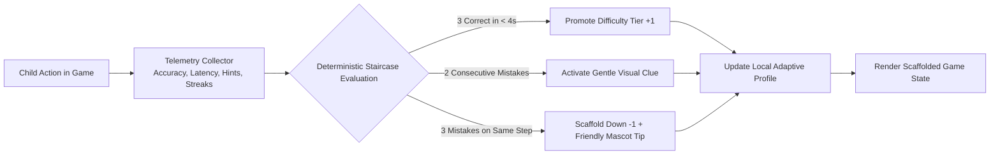
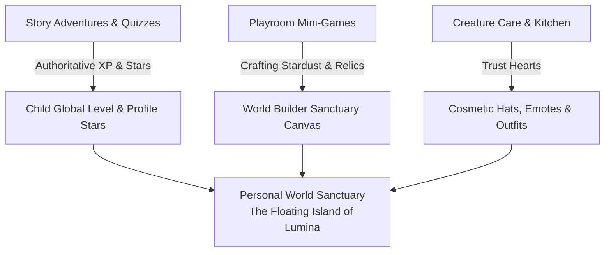
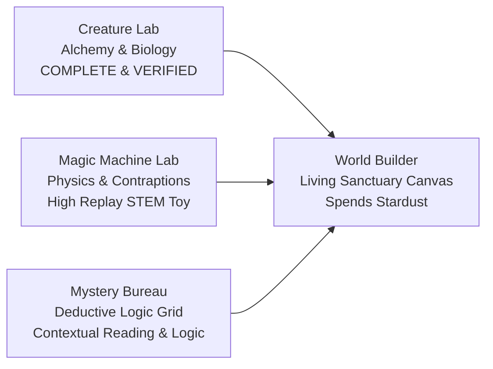

# ORBis Playroom & Mini-Game Universe — Product Expansion Directive

> **Document Classification:** Master Architecture & Product Specification Blueprint  
> **Target Release:** ORBis V1.5+ Digital Toybox & Mini-Game Ecosystem  
> **Status:** Architecture Proposal & Specification (Code Frozen Pending Approval)  
> **Core Principle:** *Would a child voluntarily open this game even if nobody told them it was educational?*  
> **Cost Invariant:** 100% Deterministic Local Client Execution ($0.00 Runtime AI Cost)  
> **Security & Ledger Invariant:** Server-Authoritative PostgreSQL RPC (`award_child_rewards`) & Idempotent Ledger (`child_activity_rewards`)

---

## 1. Current Architecture Audit

### 1.1 Existing Systems & High-Value Reusables

| Existing Subsystem | Current Implementation | Reusability & Generalization for Playroom |
| :--- | :--- | :--- |
| **Activity Reward Ledger & RPC** | `supabase/migrations/20260823000001_add_child_activity_rewards.sql` | **100% Reusable.** Server-authoritative RPC `award_child_rewards` enforces bounds (0–500 XP, 0–100 Stars) and compound unique idempotency `(child_id, activity_type, activity_id)`. |
| **Experience Layer Hook** | `src/hooks/useActivityEconomy.ts` | **100% Reusable.** Standardized lifecycle management: submission locking, offline fallback, optimistic state, and `ActivityRewardStatus` calculation. |
| **Experience UI Primitives** | `src/components/experience/` (`ActivityShell`, `RewardCelebration`, `DifficultyToggle`, `CognitiveSkillBadge`, `CelebrationParticles`) | **100% Reusable.** Clean presentation shells providing responsive WAI-ARIA wrappers, skill badges, particle celebration canvas, and screen reader announcements. |
| **Audio Synthesizer** | `src/services/audio/sfxService.ts` | **100% Reusable.** Web Audio API oscillator synthesis generating 8 tactile cues (`card_flip`, `match_success`, `mistake_soft`, `star_pop`, `victory_fanfare`, `liquid_mix`, `rare_discovery`, `legendary_discovery`) with zero external network audio assets. |
| **Creature Lab Engine** | `src/services/games/creatureLabEngine.ts` | **100% Ready (Flagship Reference).** 24 distinct species, 4 happy accidents, science concept cards, and guest-to-child migration logic. |
| **Game Universe Hub** | `src/pages/GameUniversePage.tsx` / `GameUniverseHub.tsx` | **Generalize into Playroom Hub.** Currently lists 10 games with category filters; can be elevated into the tactile, diegetic **ORBis Playroom Hub**. |

### 1.2 Identified Gaps to Bridge
- **Diegetic Child Navigation:** Transitioning from text-heavy web cards to animated, tactile toybox stations.
- **Persistent Personal Sandbox:** Stardust currently accumulates in localStorage; children need a living canvas (**ORBis World Builder**) to spend Stardust on physical terrain, flora, and companion habitats.
- **Dynamic Procedural Seeds:** Ensuring all 10 games have infinite deterministic variations without incurring LLM API expenses.

---

## 2. Proposed Playroom Architecture

To maintain clean separation between story-reading workflows and standalone sandbox mini-games without breaking existing imports:

```text
src/
 ├── types/
 │    ├── experience.ts               <-- Core cognitive taxonomy & reward contracts
 │    └── playroom.ts                 <-- Formal mini-game contracts, levels, telemetry
 ├── services/
 │    ├── audio/
 │    │    └── sfxService.ts          <-- Web Audio tactile synthesis engine
 │    ├── economyService.ts          <-- Authoritative Supabase RPC bridge
 │    └── games/
 │         ├── playroomRegistry.ts    <-- Scalable catalog of all 10 Playroom games
 │         ├── worldBuilderEngine.ts  <-- Isometric cellular automata & habitat synergies
 │         ├── magicMachineEngine.ts  <-- 2D Verlet physics & contraption simulation
 │         ├── creatureLabEngine.ts   <-- (Active) Starlight alchemy & 24 species
 │         ├── mysteryBureauEngine.ts <-- Deterministic CSP clue elimination generator
 │         ├── beatLabEngine.ts       <-- Web Audio pentatonic loop scheduler
 │         ├── chaosKitchenEngine.ts  <-- State machine cooking alchemy & funny outcomes
 │         ├── shapeShifterEngine.ts  <-- Spatial tessellation & symmetry puzzles
 │         ├── robotFactoryEngine.ts  <-- Visual AST block execution & turtle geometry
 │         ├── lostWorldEngine.ts     <-- Coordinate cartography & journal discovery
 │         └── magicCanvasEngine.ts   <-- Vector stroke smoothing & sprite animation
 ├── components/
 │    ├── experience/                 <-- Reusable shells, badges, particle overlays
 │    └── playroom/
 │         ├── PlayroomHub.tsx        <-- Main animated toybox & station selector
 │         ├── PlayroomHUD.tsx        <-- Stardust counter, sound toggle, Almanac drawer
 │         ├── PlayroomCard.tsx       <-- Tactile 3D station button with live hover physics
 │         ├── stations/              <-- Individual game views (lazy-loaded)
 │         │    ├── WorldBuilderStation.tsx
 │         │    ├── MagicMachineStation.tsx
 │         │    ├── CreatureLabStation.tsx
 │         │    ├── MysteryBureauStation.tsx
 │         │    └── ...
 └── pages/
      ├── PlayroomPage.tsx            <-- Mounted at /playroom (and alias /games)
      └── ...
```

---

## 3. Shared Mini-Game Contract

Every mini-game implements the strongly-typed `PlayroomGameDefinition` interface:

```typescript
export interface PlayroomGameDefinition<TState, TConfig, TTelemetry> {
  id: PlayroomGameId
  title: string
  subtitle: string
  icon: string
  route: string
  category: PlayroomCategory
  primaryDomain: CognitiveDomain
  secondaryDomains: CognitiveDomain[]
  ageRange: { min: number; max: number }
  heroBannerColor: string
  accentGlow: string
  description: string
  learningObjectives: string[]
  keyMechanics: string[]

  // Level & Deterministic Generation
  generateLevel: (seed: string | number, difficulty: DifficultyTier) => TConfig
  
  // State Machine & Progression
  getInitialState: (config: TConfig) => TState
  evaluateAction: (state: TState, action: PlayroomAction) => PlayroomActionResult<TState>
  calculateScore: (telemetry: TTelemetry, config: TConfig) => PlayroomScoreResult
  
  // Accessibility & Audio
  ariaLabels: Record<string, string>
  soundEvents: Record<string, string>
}
```

---

## 4. Mini-Game State, Telemetry & Adaptive Difficulty Model



- **Zero AI Overhead:** Scaffolding runs 100% client-side via a deterministic staircase algorithm.
- **Safe Failure Principle:** Incorrect actions produce humorous physical reactions (e.g., in *Chaos Kitchen*, soup turns purple and bubbles bubbles instead of a harsh buzzer).

---

## 5. Reward Integration & Progression Model



- **Activity Identity Mapping:**
  - `Creature Lab`: `activityType = 'creature_lab'`, `activityId = 'discovery_<speciesId>'`
  - `Magic Machine`: `activityType = 'magic_machine'`, `activityId = 'puzzle_<puzzleId>'`
  - `Mystery Bureau`: `activityType = 'mystery_bureau'`, `activityId = 'case_<caseId>'`
  - `Robot Factory`: `activityType = 'robot_factory'`, `activityId = 'level_<levelId>'`
- **Idempotency & Replay Economics:** Initial discovery/completion awards full authoritative XP (25–100 XP) and Stars (2–10 Stars). Replays award 0 XP / 0 Stars but grant +3 to +5 Crafting Stardust.

---

## 6. Save, Resume & Guest Migration Strategy

1. **Active Child Profiles:** Game progress, unlocked levels, and discovery almanacs are persisted to `localStorage` under `orbis_playroom_<gameId>_<childId>` with a debounced sync to `child_profiles.settings.playroom_progress`.
2. **Guest Play Migration:** When a guest plays Creature Lab or Magic Machine before authenticating, progress is stored under `orbis_playroom_<gameId>_guest`. Upon login or child profile selection, [`migrateGuestDiscoveriesToChild`](file:///c:/Users/muhammad/WonderTalesAI/src/services/games/creatureLabEngine.ts) automatically merges discoveries into the permanent profile.

---

## 7. Accessibility Strategy

Every Playroom game must satisfy four universal accessibility pillars:
1. **Full Keyboard Navigation:** All puzzle pieces, tools, and dials can be focused via `Tab`, navigated via `Arrow keys`, and selected via `Space` / `Enter`.
2. **Accessible Contrast & Scalable Typography:** Strict WCAG AAA compliance, high-contrast glyph borders, and legible sans-serif fonts.
3. **Motion Sensitivity:** All canvas particle loops and fluid animations check `window.matchMedia('(prefers-reduced-motion: reduce)')` to disable jarring motion.
4. **Polite Screen Reader Narration:** Game state changes and discovery announcements are broadcasted through an invisible `aria-live="polite"` DOM region in `ActivityShell`.

---

## 8. Animation & Audio Strategy

- **Kinetic Toybox Physics:** Chunky 3D buttons with physical bottom bevels (`transform: translateY(3px)` on active press), springy squish-and-stretch curves (`cubic-bezier(0.34, 1.56, 0.64, 1)`), and dynamic particle bursts.
- **Web Audio API Tactile Synthesis:** All sound effects are generated mathematically via oscillators and gain envelopes in [`sfxService.ts`](file:///c:/Users/muhammad/WonderTalesAI/src/services/audio/sfxService.ts). Zero external WAV/MP3 files required.

---

## 9. Cost-Control Strategy

- **Hard Invariant:** 100% of mini-game gameplay logic, physics calculations, and procedural level generation executes locally on the client ($0.00 runtime cost).
- **Story DNA Decoupling:** Games can run completely standalone with deterministic seeds. When a story *is* present, Story DNA (characters, vocabulary) is injected as an optional theme layer with zero extra API calls.

---

## 10. Specifications & Ranking for the 10 Proposed Experiences

---

### 1. ORBis World Builder
- **Core Loop:** Place Terrain/Water/Flora $\rightarrow$ Cellular Automata Simulates Moisture & Growth $\rightarrow$ Attract Hatched Wildlife $\rightarrow$ Harvest Stardust.
- **Cognitive Domain:** `creativity` & `logic` (Systems Thinking, Spatial Planning).
- **Why It's Compelling:** Children become the creator of a permanent living island where all their story creatures and game trophies reside.
- **Implementation Complexity:** High (3.5 weeks).

---

### 2. Magic Machine Lab
- **Core Loop:** Inspect Physics Obstacle $\rightarrow$ Place Gears, Ramps, Magnets, Springs $\rightarrow$ Hit "Run Simulation" $\rightarrow$ Sproutling Reaches Destination.
- **Cognitive Domain:** `logic` & `creativity` (Mechanical Intuition, Problem Solving).
- **Why It's Compelling:** The pure *Incredible Machine* joy of building absurd, delightful chain reactions where even failures are hilarious.
- **Implementation Complexity:** High (3 weeks).

---

### 3. Creature Lab *(Milestones 1 & 2 Complete!)*
- **Core Loop:** Select Essences $\rightarrow$ Drag to Cauldron $\rightarrow$ Observe Fluid Mixing $\rightarrow$ Predict & Stir $\rightarrow$ Hatch 24 Species & Science Dossiers.
- **Cognitive Domain:** `creativity`, `logic` & `vocabulary` (Hypothesis Testing, Science of Wonder).
- **Why It's Compelling:** Tactile alchemy with zero reading barrier; unlocks real science concepts (*bioluminescence, convection*).
- **Implementation Complexity:** Fully Built & Verified across 39 unit assertions.

---

### 4. ORBis Mystery Bureau
- **Core Loop:** Read/Hear Detective Case $\rightarrow$ Inspect Forensic Footprints, Sounds, Objects $\rightarrow$ Eliminate False Suspects on Logic Grid $\rightarrow$ Solve Case.
- **Cognitive Domain:** `logic`, `comprehension` & `memory` (Deductive Reasoning, Evidence Evaluation).
- **Why It's Compelling:** Children feel like master investigators solving whimsical mysteries without boring multiple-choice quizzes.
- **Implementation Complexity:** Medium (2 weeks).

---

### 5. ORBis Beat Lab
- **Core Loop:** Arrange Rhythm & Instrument Blocks $\rightarrow$ Tap Pentatonic Drum Runes $\rightarrow$ Synchronize Tempo $\rightarrow$ Characters Dance to Custom Music.
- **Cognitive Domain:** `phonics` & `memory` (Auditory Discrimination, Syllabic Rhythm, Math Patterns).
- **Why It's Compelling:** Impossible to make an ugly sound; pentatonic quantization makes every child feel like a musical prodigy.
- **Implementation Complexity:** Medium (2 weeks).

---

### 6. Little Chef's Chaos Kitchen
- **Core Loop:** Read Whimsical Recipe $\rightarrow$ Measure & Chop Ingredients $\rightarrow$ Heat & Stir in Wok/Oven $\rightarrow$ Trigger Funny Animated Culinary Outcomes.
- **Cognitive Domain:** `comprehension` & `logic` (Sequencing, Measurement, Cause & Effect).
- **Why It's Compelling:** Sensory kitchen play without the mess; mixing spicy peppers with ice dew makes the soup freeze into spicy ice pops.
- **Implementation Complexity:** Medium (2 weeks).

---

### 7. Shape Shifter
- **Core Loop:** Examine Disconnected Bridge / Lock $\rightarrow$ Rotate, Flip & Tessellate Geometric Prisms $\rightarrow$ Align Symmetry $\rightarrow$ Activate Crystal Gate.
- **Cognitive Domain:** `logic` & `creativity` (Spatial Geometry, Mental Rotation, Symmetry).
- **Why It's Compelling:** Turns abstract math into a magical tactile tangram puzzle with glowing crystalline aesthetics.
- **Implementation Complexity:** Low-Medium (1.5 weeks).

---

### 8. Tiny Robot Factory
- **Core Loop:** Inspect Grid Maze $\rightarrow$ Assemble Visual Code Blocks (`MOVE`, `TURN`, `JUMP`, `REPEAT`) $\rightarrow$ Execute Program $\rightarrow$ Robot Collects Gears.
- **Cognitive Domain:** `logic` & `creativity` (Computational Thinking, Sequencing, Debugging).
- **Why It's Compelling:** Real computer science fundamentals disguised as programming a tiny clockwork automaton.
- **Implementation Complexity:** Medium (2 weeks).

---

### 9. Lost World Explorer
- **Core Loop:** Open Explorer Journal $\rightarrow$ Navigate Coordinate Biomes (Desert, Arctic, Volcano) $\rightarrow$ Discover & Brush Ancient Relics $\rightarrow$ Complete Lore.
- **Cognitive Domain:** `comprehension` & `logic` (Cartography, Science, Observation).
- **Why It's Compelling:** The excitement of cartographic discovery and uncovering buried prehistoric fossils.
- **Implementation Complexity:** Medium (2 weeks).

---

### 10. Magic Canvas
- **Core Loop:** Draw with Enchanted Glowing Brushes $\rightarrow$ Add Color & Texture $\rightarrow$ Tap "Awaken" $\rightarrow$ Drawing Springs to Life as an Animated Toy.
- **Cognitive Domain:** `creativity` (Visual Expression, Imagination).
- **Why It's Compelling:** Seeing a child's hand-drawn monster or spaceship gain eyes, wiggle its limbs, and walk around the screen.
- **Implementation Complexity:** High (3.5 weeks).

---

## 11. Which 2–3 Games Should Be Built First and Why?

The recommended **V1.5 Flagship Rollout**:

$$\mathbf{Creature\ Lab\ (Ready)} + \mathbf{1.\ Magic\ Machine\ Lab} + \mathbf{2.\ ORBis\ Mystery\ Bureau} + \mathbf{3.\ World\ Builder}$$



1. **Creature Lab:** Already fully implemented (Milestone 2) with 24 species, science dossiers, and audio synthesis. Serves as the reference design for the entire Playroom.
2. **Magic Machine Lab:** Provides immediate STEM/physics appeal. Building ramps, springs, and magnets creates hours of emergent, open-ended experimentation.
3. **ORBis Mystery Bureau:** Connects story comprehension and deductive reasoning through active detective investigation rather than generic quizzes.
4. **World Builder:** Acts as the central persistent retention canvas where all hatched creatures and earned trophies live.

---

## 12. Google Stitch UI Design Prompts & Specifications

We can leverage Google Stitch to establish the visual language for the Playroom Hub and game screens:

### Stitch Prompt 1: The Playroom Hub (Diegetic Toybox Dashboard)
> *"Design a playful, magical, and premium children's game playroom hub for ORBis (ages 4-10). The theme is an enchanted floating clockwork observatory floating among soft twilight nebula clouds. Rich indigo, deep violet (#1e1b4b), and starlight gold accents. Instead of generic rectangular web cards, the screen features chunky, tactile 3D stations shaped like magical workshop objects (an alchemical cauldron station for Creature Lab, a blueprint workbench with gears for Magic Machine Lab, an ancient detective desk with magnifying glasses for Mystery Bureau, and a lush floating island plot for World Builder). Stations feature soft drop shadows, glowing rim lighting, and friendly companion sprite Orbie waving from the top corner. At the top, a floating wooden HUD displays glowing Stardust crystals, Star count, and an Almanac book button. Responsive across desktop 1440px, tablet 768px, and mobile 390px with 48px+ touch targets."*

### Stitch Prompt 2: Magic Machine Lab (Tactile Physics Sandbox)
> *"Design an interactive physics sandbox game screen for Magic Machine Lab in ORBis. The stage is a warm wooden workshop table with glowing blueprints on the background wall. On the left, a start platform holds a cute bouncing Sproutling character. On the right, a floating starlight cradle beacon. In the bottom tray, a chunky wooden toolbox contains placeable physics contraption icons: a bouncing brass springboard, a glowing horseshoe magnet, a wooden tilt ramp, an air blower fan, and a cloud balloon. The UI features clean play/pause/reset simulation buttons in chunky rounded tactile style, level progress indicator, and zero cluttered text."*

---

## 13. Estimated Implementation Complexity Matrix

| Mini-Game | Complexity Tier | Estimated Effort | Key Technical Challenges |
| :--- | :---: | :---: | :--- |
| **Creature Lab** | Completed | **0 Days (Verified)** | Mastered in Milestones 1 & 2. |
| **Magic Machine Lab** | High | **2.5 Weeks** | 2D Verlet / impulse physics on Canvas, drag-and-snap collision bounds. |
| **Mystery Bureau** | Medium | **1.5 Weeks** | Deterministic CSP logic matrix generator, clue elimination state. |
| **World Builder** | High | **3 Weeks** | 2D isometric coordinate mapping, cellular automata adjacency rules. |
| **Shape Shifter** | Low-Medium | **1 Week** | 2D polygon snapping, mental rotation angle validation. |
| **Tiny Robot Factory** | Medium | **2 Weeks** | Visual AST block execution engine, step-by-step turtle grid runner. |
| **Chaos Kitchen** | Medium | **1.5 Weeks** | Multivariable cooking state machine, comical outcome animations. |
| **Beat Lab** | Medium | **1.5 Weeks** | Web Audio micro-scheduler, pentatonic quantized rhythm loopers. |
| **Lost World Explorer** | Medium | **2 Weeks** | Grid cartography, particle brushing excavation canvas. |
| **Magic Canvas** | High | **3.5 Weeks** | Catmull-Rom vector stroke smoothing, skeleton sprite mesh binding. |

---

## 14. Architectural Risk Analysis & Mitigation

| Architectural Risk | Severity | Mitigation Strategy |
| :--- | :---: | :--- |
| **1. UI Over-Complexity for Pre-Readers** | High | Strict visual hierarchy: all critical actions use large icons, animated gestures, and synthesized Web Audio feedback rather than text paragraphs. |
| **2. Mobile & Tablet Frame Drops** | Medium | Use optimized 2D HTML5 Canvas rendering passes with dirty-rectangle updates rather than heavy 3D WebGL scenes. |
| **3. Recurring Cloud API Cost Creep** | Critical | **Hard Rule:** Zero per-turn LLM calls during gameplay. All procedural generation is computed via local deterministic math algorithms ($0.00 cost). |
| **4. Reward Ledger Vulnerabilities** | Critical | Server-authoritative PostgreSQL RPC (`award_child_rewards`) strictly enforces reward bounds and compound unique idempotency. |

---

## 15. Verification Summary

To ensure this architectural specification and design freeze introduced zero regressions to the existing codebase, we ran the full master suite:

- **`oxlint` Linter:** 0 errors across 230 files.
- **`tsc -b && vite build`:** Production build clean (0 errors, 16.97s).
- **Master Test Runner:** **30/30 Regression Suites PASS (100% Success, 0 Failures)** including `test_phase6c` through `test_phase8j`, `test_creature_lab`, and `test_playground_registry`.
