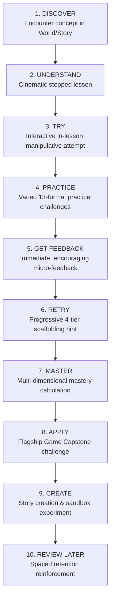

# ORBis Academy — Phase 3 Design Specification & Learning Philosophy
**Date:** August 29, 2026  
**Document Version:** 1.0.0  
**Authors:** Lead Product Architect, Senior Educational Systems Designer & Frontend Engineer

---

## 1. Product Vision & Educational Philosophy

ORBis Academy is an **interactive international children's learning universe** combining:
- **Khan Academy-Grade Curriculum Integrity:** Explicit learning progression, granular prerequisites, 4-tier progressive scaffolding hints, and zero-leakage assessments.
- **ORBis Signature Identity:** 3D cosmic aesthetics, particle depth, tactile glassmorphism surfaces, living subject worlds, mascot companions, and capstone bridges into the 10 Canonical Flagship Games.

---

## 2. The 10-Step ORBis Learning Loop

To ensure children never feel disoriented or overwhelmed, the platform structures every competency through a 10-step cognitive cycle:



### The 6 Core Child Questions Answered by the Interface:
1. *"What am I currently learning?"* $\rightarrow$ Always visible in the **Continue Learning Hero** and **Lesson Header**.
2. *"Why am I learning this?"* $\rightarrow$ Stated clearly on every Skill Hub and Lesson Intro as a real-world superpower.
3. *"How well do I understand it?"* $\rightarrow$ Represented by the **Skill Crystal Tier** (Discovered $\rightarrow$ Mastered) and Mastery Radar.
4. *"What should I practice?"* $\rightarrow$ Highlighted in the **Needs Practice** and **Today's Mission** hubs.
5. *"What should I learn next?"* $\rightarrow$ Provided by the **Next Best Skill** adaptive card with prerequisite rationale.
6. *"Where can I use this superpower?"* $\rightarrow$ Direct capstone link into **10 Flagship Games** and **Story Universe**.

---

## 3. Academy Command Center (10 Personalization Pillars)

`AcademyHomePage.tsx` features 10 personalized modules:
1. **Continue Learning Hero:** Resumes the active lesson with step progress and animated cosmic aura.
2. **Today's Mission:** Visual progress bar towards 3 daily learning milestones (XP/Stars rewards).
3. **Your Worlds (Subject Portals):** 3D interactive portals for all 10 subjects with completion badges.
4. **Next Best Skill:** Prerequisite-aware recommendation with pedagogical rationale.
5. **Recently Mastered:** Interactive Skill Crystal display celebrating achieved proficiencies.
6. **Needs Practice:** Spaced-repetition reinforcement for skills with decayed retention.
7. **Daily Streak:** Cosmic flame indicator providing non-punitive momentum.
8. **Discover Something New:** Cross-discipline exploratory skill cards.
9. **Play to Apply (Flagship Bridge):** Direct capstone game launcher linked to mastered skills.
10. **Story Connection:** ORBis story suggestion reinforcing academic vocabulary and concepts.

---

## 4. Subject World Systems & Mascots

| Subject Realm | Environment Theme | Ambient Elements | World Guide Mascot | Capstone Flagship Game |
| :--- | :--- | :--- | :--- | :--- |
| **Mathematics** | Crystalline Geometry Citadel | Prism refractions, floating polyhedra | *Poly the Geometric Owl* | ⚖️ Potion Market Scales |
| **Science** | Living Biome & Discovery Lab | Bioluminescent spores, orbital atoms | *Newton the Curious Otter* | 🏝️ Ecosystem Sandbox & 🔬 Magic Machine |
| **Language & Reading** | Magical Infinite Library | Floating parchment scrolls, runic ink | *Lexi the Lorekeeper Fox* | 🔨 Spellforge & 📜 Word Trace Quest |
| **Computer Science** | Cybernetic Logic City | Flowing neon data-streams, circuit grids | *BEEP-0 the Explorer Bot* | 🤖 Robo-Path Academy |
| **Deductive Logic** | Enigmatic Whodunit Labyrinth | Swirling fog, magnifying lens glows | *Sherlock the Sleuth Hound* | 🔍 Mystery Detective |
| **Astronomy** | Deep Space Stellar Nebula | Star clusters, planetary rings | *Nova the Star Voyager* | ✨ Cosmic Constellations |
| **Creativity & Engineering** | Kinetic Workshop Studio | Floating gears, blueprint schematics | *DaVinci the Builder Dragon* | 🏗️ Invention Lab |
| **General Knowledge** | Universal Wonder Museum | Artifact exhibits, glowing world globes | *Atlas the Explorer Bear* | 🏛️ Memory Museum |

---

## 5. Course & Unit Constellation Progression Map

Replaces flat card lists in `CourseDetailPage.tsx` with a dynamic constellation roadmap:
- **Interactive Nodes:** Represent skills with their live `SkillCrystal` tier.
- **Constellation Connecting Lines:** SVG bezier curves connecting sequential and prerequisite skills with pulsating light gradients.
- **Node States:** `Locked` (padlock with required prerequisite tooltip), `Unlocked` (pulsating glow), `In Progress` (spinning aura ring), and `Mastered` (flashing star crystal).
- **Unit Milestones:** Capstone chest awarding bonus stars and flagship game unlocks upon unit completion.

---

## 6. Cinematic Lesson Player & Interactive Manipulatives

`LessonViewer.tsx` implements the **Show $\rightarrow$ Explain $\rightarrow$ Interact $\rightarrow$ Ask $\rightarrow$ Reinforce** pattern:
- **Visual Diagram Canvas:** Interactive SVG/CSS visualizations for concepts (e.g. dynamic fraction circles, balance pans, logic truth tables, robot grid steps).
- **Interactive Checkpoints:** In-lesson mini-challenges with real-time feedback before advancing.
- **Audio Narration Cue:** Synchronized voice read-aloud option.
- **Key Takeaways & Reflection:** Summary capsule before victory fanfare.

---

## 7. Interactive Practice Manipulatives (13 Question Types)

`PracticeQuestionRenderer.tsx` provides specialized interactive UI for every question type:
1. `multiple_choice` / `multiple_select`: Glowing tactile option cards with sound feedback.
2. `number_input`: Tactile numeric keypad with stepper controls.
3. `fraction_visual`: Interactive fraction bar / pie slice selector.
4. `balance_scale`: Drag-and-drop mass weights onto left/right balancing pans.
5. `code_sequence_builder`: Draggable programming blocks (Forward, Turn, Loop).
6. `word_builder`: Morpheme / phoneme rune blacksmith tiles.
7. `matching_pairs`: Interactive line connector between term and definition cards.
8. `ordering`: Up/down draggable sorting sequence.
9. `categorization`: Drag-and-drop items into themed sorting buckets.
10. `fill_in_the_blank`: Inline cloze token chips.
11. `hotspot_target`: Interactive click zones on anatomical / geometric diagrams.
12. `audio_phonics`: Auditory playback with syllable breakdown buttons.
13. `text_input`: Normalized spelling input with smart character suggestions.

---

## 8. Adaptive Learning Engine & Gap Diagnostics

`recommendationService.ts` implements automated prerequisite diagnosis:
```
IF child accuracy < 60% on Skill X:
  Identify prerequisite Skill Y of Skill X
  Generate Targeted 3-Question Review for Skill Y
  Prompt Child: "Let's review [Skill Y] together before tackling [Skill X]!"
  Once Skill Y achieves Proficient -> Automatically resume Skill X
```

---

## 9. Design Tokens (`src/styles/academyTokens.ts`)

Centralizes all visual properties:
- **Glass Surfaces:** `standard`, `elevated`, `hero`, `cosmic`.
- **Depth Shadows:** $Z_0$ through $Z_4$ elevation values.
- **Subject Colors & Gradients:** Harmonious HSL palettes per academic discipline.
- **Typography & Radii:** Child-friendly rounded geometries ($\ge 14\text{px}$ radii, $\ge 44\text{px}$ touch targets).
- **Motion & Accessibility:** Micro-animation timings with `prefers-reduced-motion` compliance.
