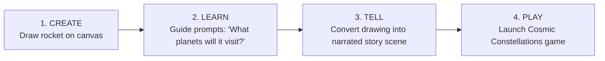

# ORBis Creative Studio Specification: The CREATE → LEARN → TELL Loop
**Date:** August 29, 2026  
**Version:** 1.0.0  

---

## 1. Overview & Pedagogical Purpose

The **ORBis Creative Studio** (`CreativeStudioPage.tsx`) provides children with open-ended digital artistic tools to express understanding, synthesize academic concepts, and create stories.

Instead of passive consumption, learning becomes active creation:

---

## 2. Studio Modes & Toolsets

| Mode | Tools Available | Description |
| :--- | :--- | :--- |
| **Draw & Paint** | Magic glow brushes, watercolor, crayon, pencil, eraser, size slider | Freehand digital sketching with particle ink trails |
| **Coloring Book** | Bucket fill, color palette, outline presets (Animals, Space, Nature, Castles) | Guided coloring with smart edge boundary detection |
| **Sticker Stamp** | 6 Themed sticker packs (Cosmic, Animals, Nature, Geometry, Fantasy, Machines) | Drag, scale, rotate, and stamp high-res animated stickers |
| **Character Maker** | Body shapes, eyes, mouths, hats, accessories, color tints | Assemble custom creatures with personality badges |
| **Scene Builder** | Background landscapes (Space, Ocean, Jungle, City), weather effects | Multi-layer stage composition with draggable props |
| **Story Maker** | Audio record prompt, text caption box, guide narration synthesis | Generates an animated read-aloud story from the canvas |

---

## 3. Child Portfolio & Persistence

- Creations are saved to the child's local portfolio and synchronized to Supabase storage.
- Each artifact preserves metadata: date created, theme tags, associated academic skill, and optional voice recording.
- Parents can view, download, and celebrate their child's creative portfolio in the Parent Zone.
