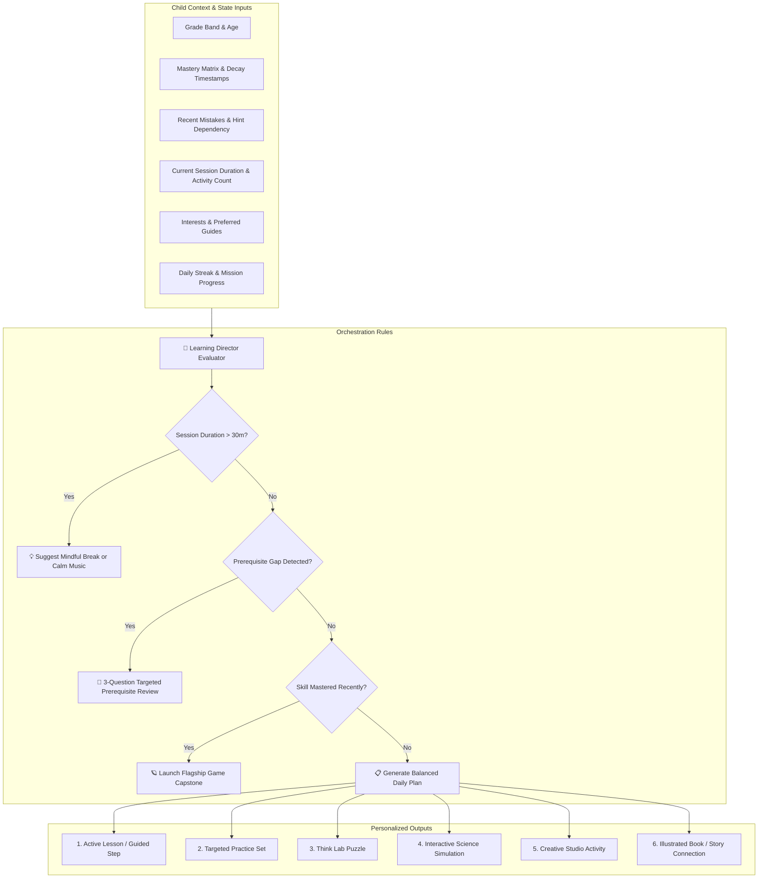

# ORBis Learning Director: Central Adaptive Orchestration Specification
**Date:** August 29, 2026  
**Version:** 1.0.0  

---

## 1. Role & Objective

The **Learning Director** (`learningDirector.ts`) is the central intelligence engine of ORBis. It continuously answers the fundamental question:

$$\text{"What should this child do next?"}$$

It dynamically harmonizes structured academic progression with creative expression, story immersion, critical thinking, science experimentation, and flagship game capstones while actively monitoring fatigue and engagement signals.

---

## 2. Decision Engine Architecture

---

## 3. Daily Adaptive Plan Composition

The Learning Director balances daily learning time based on grade band:

| Grade Band | Max Session Duration | Academic Focus | Creative / Play Focus | Reflection / Story Focus |
| :--- | :---: | :---: | :---: | :---: |
| **Pre-K / Nursery** | 15–20 min | 5 min Phonics / Numbers | 8 min Draw / Music / Stickers | 5 min Read-Aloud Story |
| **Kindergarten** | 20–25 min | 8 min Math / Reading | 8 min Creative Studio / Science | 6 min Book / Capstone |
| **Grades 1–2** | 25–35 min | 12 min Lesson + Practice | 10 min Think Lab / Science Lab | 8 min Story / Flagship Game |
| **Grades 3–5** | 35–45 min | 18 min Multi-Step Practice | 12 min Project Studio / Coding | 12 min Capstone / Writing |

---

## 4. Prerequisite Gap Remediation Algorithm

When a child's accuracy falls below $60\%$ or hint usage exceeds $2.0$ hints/question on Skill $S_X$:
1. Trace immediate prerequisite $S_{prereq}$ in `curriculumRegistry`.
2. Generate a targeted 3-question diagnostic set on $S_{prereq}$.
3. Dispatch guide prompt: *"Let's review [$S_{prereq}$] together with [Guide Name] before continuing!"*
4. Upon reaching Proficient ($Score \ge 80\%$) on $S_{prereq}$, smoothly resume $S_X$.
