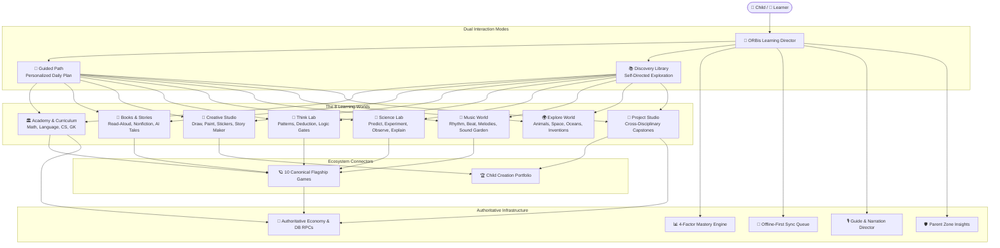

# ORBis Learning Universe: Master Architecture Specification
**Date:** August 29, 2026  
**Version:** 1.0.0  
**Status:** Production Standard  

---

## 1. System Overview & Core Philosophy

ORBis is an integrated, developmental, child-first learning universe. It bridges foundational academics, interactive storybooks, critical thinking puzzles, science laboratories, creative studio composition, music, and flagship educational games into a unified experience orchestrated by an adaptive **Learning Director**.

---

## 2. Core Architectural Pillars

### 1. Dual Mode: Guided Path vs. Discovery Library
- **Guided Path:** An adaptive daily sequence generated by the Learning Director tailored to the child's grade, attention span, prerequisite gaps, and recent successes (e.g. 8 min Math + 7 min Reading + 5 min Think Lab + 10 min Creative Studio + Flagship Capstone).
- **Discovery Library:** A 15-category searchable, filterable content hub where children can freely browse books, videos, games, science experiments, art activities, and stories.

### 2. Developmental Grade Adaptation
Every asset and UI layout conforms to developmental stage profiles:
- **Pre-K / Nursery (Ages 3–4):** Narration-first, large single-touch targets, pictorial prompts, 3–5 min activities, zero reading dependency.
- **Kindergarten (Ages 5–6):** Phonics-supported audio, drag-and-drop manipulatives, early sight-word highlighting, 5–8 min activities.
- **Grades 1–2 (Ages 6–8):** Interactive diagrams, guided reading, basic numerical inputs, 8–12 min activities.
- **Grades 3–5 (Ages 8–11):** Multi-step problem solving, code sequence building, scientific hypothesis testing, cross-disciplinary projects, 12–20 min activities.

### 3. The ORBis 12-Step Educational Experience Loop
Every major activity follows the pedagogical sequence:
$$\text{Welcome} \rightarrow \text{Introduce} \rightarrow \text{Show} \rightarrow \text{Explain} \rightarrow \text{Interact} \rightarrow \text{Ask} \rightarrow \text{Guide} \rightarrow \text{Practice} \rightarrow \text{Reflect} \rightarrow \text{Reinforce} \rightarrow \text{Apply} \rightarrow \text{Celebrate}$$

### 4. Authoritative Infrastructure & Offline Resiliency
- State and rewards are computed with idempotent cryptographic signatures and stored locally with optimistic queuing for seamless offline learning.
- Synchronization with Supabase backend occurs automatically when connectivity is restored, preventing any loss of child mastery, streak, or portfolio items.
