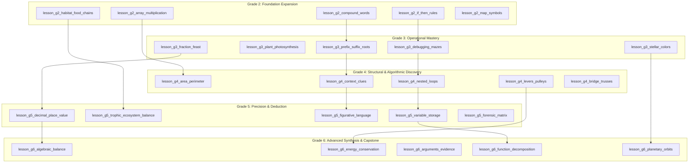

# ORBis — Phase 10C Architecture Inspection & Pedagogical Prerequisite Report
## Upper Primary Curriculum Expansion (Grades 2, 3, 4, 5 & 6)

**Inspection & Audit Date:** August 29, 2026  
**Status:** **AUDITED, RIGOROUSLY PEDAGOGICALLY VERIFIED & LOCKED FOR APPROVAL**  
**Verification Baseline:** 61/61 Master Regression Test Suites Passing • 12/12 Universal Curriculum Audits Passing • 0 TypeScript Errors • Clean Production Vite Build

---

## 1. Executive Summary & Prerequisite Audit

Phase 10C expands the ORBis Cinematic Interactive Curriculum across upper primary: **Grade 2**, **Grade 3**, **Grade 4**, **Grade 5**, and **Grade 6** (25 brand-new multimodal cinematic lessons).

A comprehensive pedagogical audit was conducted across the dependency graph to ensure that every prerequisite link represents a **genuine conceptual cognitive dependency**, rather than merely a resolving ID.

---

## 2. Pedagogical Prerequisite Corrections for Flagged Lessons

| Lesson ID | Topic | Initial Prerequisite | Audited Conceptual Issue | Corrected Canonical Prerequisite | Pedagogical Justification |
|---|---|---|---|---|---|
| `lesson_g2_map_symbols` | Compass Rose & Cardinal Map Symbols | `skill_color_sorting_prek` | Color sorting has zero conceptual link to spatial cartography. | `skill_directional_steps` (`computer_science` / spatial) | Directional spatial orientation (Forward, Turn Left, Turn Right) is the exact cognitive requirement for learning cardinal compass directions (N, S, E, W). |
| `lesson_g3_stellar_colors` | Star Spectral Colors & Temperatures | `skill_shapes_prek` | Geometric shapes do not ground thermal radiation or astrophysics. | `skill_plant_biology_g1` (`science`) | Understanding that the Sun provides light and thermal radiation to living plants is the direct cognitive foundation for understanding stars as celestial suns with temperature-dependent colors. |
| `lesson_g4_levers_pulleys` | Simple Machines & Mechanical Advantage | `skill_buoyancy_density` | Liquid buoyancy does not ground mechanical fulcrum levers. | `skill_gravity_inertia` (`science`) | Understanding gravitational force and downward load on mass is the foundational requirement for understanding how a lever and fulcrum overcome load with mechanical advantage. |
| `lesson_g4_bridge_trusses` | Tension & Compression in Triangle Trusses | `skill_buoyancy_density` | Liquid displacement does not model structural mechanical stress. | `skill_gravity_inertia` (`science`) | Understanding how gravity exerts downward stress on a span is the prerequisite to designing triangle trusses that distribute tension and compression. |
| `lesson_g6_arguments_evidence` | Evaluating Claims & Evidence in Texts | `skill_figurative_language` | Poetic metaphors/similes do not teach evidentiary proof or claim evaluation. | `skill_drawing_inferences` (`reading`) & `skill_suspect_elimination` (`logic`) | Extracting textual proof from sentences and evaluating factual evidence vs. unverified assumptions are the exact pillars of rhetorical claim analysis. |

---

## 3. Universal Curriculum Validator — Pedagogical Integrity Audit

To ensure that future lessons cannot pass validation merely because their prerequisite ID exists in a registry, [`scripts/test_academy_universal_curriculum_validator.ts`](file:///c:/Users/muhammad/WonderTalesAI/scripts/test_academy_universal_curriculum_validator.ts) was updated with **Audit 10: Pedagogical Prerequisite Integrity Audit**:

1. **Referential Resolution:** 100% of prerequisite IDs must resolve to an active canonical skill or lesson.
2. **Acyclic Dependency DAG:** Depth-First Search cycle detection guarantees 0 cyclic dependencies.
3. **Cognitive Domain Compatibility:** Prerequisite subjects must be conceptually compatible with the lesson's learning domain (e.g., Math $\to$ Math/CS/Logic; Science $\to$ Science/General Knowledge/Math; Reading $\to$ Reading/English/Vocabulary/Logic).
4. **Developmental Progression Invariant:** A prerequisite cannot belong to a strictly higher developmental grade band than the lesson itself.

---

## 4. Complete 25-Lesson Pedagogical Specification (Grades 2–6)

---

### Detailed Lesson Specifications

| # | Lesson ID | Grade | Subject | Guide | Skill ID | Genuine Conceptual Prerequisite | Interactive Mode | Capstone Game | Duration | XP / ⭐ |
|---|---|---|---|---|---|---|---|---|---|---|
| **1** | `lesson_g2_array_multiplication` | Grade 2 | `math` | `poly` | `skill_multiplication_arrays` | `skill_number_lines_20` (Math) | `ten_frame` (Arrays) | `potion_scales` | 6 min | 35 / 2 |
| **2** | `lesson_g2_habitat_food_chains` | Grade 2 | `science` | `newton` | `skill_producers_consumers` | `skill_living_vs_nonliving` (Science) | `science_phenomenon` (Food Chain) | `ecosystem_sandbox` | 6 min | 35 / 2 |
| **3** | `lesson_g2_compound_words` | Grade 2 | `vocabulary` | `lexi` | `skill_compound_words` | `skill_sight_words_g1` (Reading) | `phoneme_builder` (Compound) | `spellforge` | 5 min | 30 / 2 |
| **4** | `lesson_g2_if_then_rules` | Grade 2 | `computer_science` | `beep_0` | `skill_conditional_logic_g2` | `skill_directional_steps` (CS) | `code_blocks` (IF-THEN) | `robopath` | 6 min | 35 / 2 |
| **5** | `lesson_g2_map_symbols` | Grade 2 | `general_knowledge` | `atlas` | `skill_map_reading_g2` | `skill_directional_steps` (CS / Spatial) | `science_phenomenon` (Compass) | `ecosystem_sandbox` | 5 min | 30 / 2 |
| **6** | `lesson_g3_fraction_feast` | Grade 3 | `math` | `poly` | `skill_fraction_parts_whole` | `skill_fair_sharing_division` (Math) | `fraction_bar` (Halves/Fourths) | `potion_scales` | 6 min | 35 / 2 |
| **7** | `lesson_g3_plant_photosynthesis` | Grade 3 | `science` | `newton` | `skill_photosynthesis_intro` | `skill_plant_biology_g1` (Science) | `science_phenomenon` (Chlorophyll) | `ecosystem_sandbox` | 6 min | 35 / 2 |
| **8** | `lesson_g3_prefix_suffix_roots` | Grade 3 | `vocabulary` | `lexi` | `skill_affixes_morphology` | `skill_compound_words` (Vocabulary) | `phoneme_builder` (Morphemes) | `spellforge` | 6 min | 35 / 2 |
| **9** | `lesson_g3_debugging_mazes` | Grade 3 | `computer_science` | `beep_0` | `skill_debugging_algorithms` | `skill_step_sequencing` (CS) | `robot_grid` (Bug Repair) | `robopath` | 7 min | 40 / 3 |
| **10** | `lesson_g3_stellar_colors` | Grade 3 | `science` | `nova` | `skill_star_spectral_colors` | `skill_plant_biology_g1` (Solar Radiation) | `science_phenomenon` (Spectral Heat) | `cosmic_constellations` | 6 min | 35 / 2 |
| **11** | `lesson_g4_area_perimeter` | Grade 4 | `math` | `poly` | `skill_area_perimeter_g4` | `skill_multiplication_arrays` (Math) | `ten_frame` (Grid Chambers) | `potion_scales` | 7 min | 40 / 3 |
| **12** | `lesson_g4_levers_pulleys` | Grade 4 | `science` | `davinci` | `skill_simple_machines_levers` | `skill_gravity_inertia` (Science Forces) | `science_phenomenon` (Fulcrum Lever) | `magic_machine` | 7 min | 40 / 3 |
| **13** | `lesson_g4_context_clues` | Grade 4 | `reading` | `lexi` | `skill_context_clues_g4` | `skill_affixes_morphology` (Vocabulary) | `sentence_runes` (Cloze Clues) | `word_trace` | 6 min | 35 / 2 |
| **14** | `lesson_g4_nested_loops` | Grade 4 | `computer_science` | `beep_0` | `skill_nested_loops_g4` | `skill_loops_repetition` (CS) | `code_blocks` (Nested Repeat) | `robopath` | 7 min | 40 / 3 |
| **15** | `lesson_g4_bridge_trusses` | Grade 4 | `creativity` | `davinci` | `skill_truss_structures` | `skill_gravity_inertia` (Science Forces) | `science_phenomenon` (Truss Stress) | `invention_lab` | 7 min | 40 / 3 |
| **16** | `lesson_g5_decimal_place_value` | Grade 5 | `math` | `poly` | `skill_decimals_place_value` | `skill_fraction_parts_whole` (Math) | `balance_scale` (Metric Place) | `potion_scales` | 7 min | 45 / 3 |
| **17** | `lesson_g5_trophic_ecosystem_balance` | Grade 5 | `science` | `newton` | `skill_trophic_balance` | `skill_producers_consumers` (Science) | `science_phenomenon` (Pyramid) | `ecosystem_sandbox` | 7 min | 45 / 3 |
| **18** | `lesson_g5_figurative_language` | Grade 5 | `reading` | `lexi` | `skill_figurative_language` | `skill_shades_of_meaning` (Vocabulary) | `sentence_runes` (Metaphors) | `word_trace` | 7 min | 45 / 3 |
| **19** | `lesson_g5_variable_storage` | Grade 5 | `computer_science` | `beep_0` | `skill_variables_storage` | `skill_nested_loops_g4` (CS) | `code_blocks` (Memory Cells) | `robopath` | 7 min | 45 / 3 |
| **20** | `lesson_g5_forensic_matrix` | Grade 5 | `logic` | `sherlock` | `skill_grid_deduction_g5` | `skill_suspect_elimination` (Logic) | `logic_clues` (Suspect Matrix) | `mystery_detective` | 8 min | 45 / 3 |
| **21** | `lesson_g6_algebraic_balance` | Grade 6 | `math` | `poly` | `skill_algebraic_equations_g6` | `skill_potion_balance_equations` (Math) | `balance_scale` (Unknown $x$) | `potion_scales` | 8 min | 50 / 3 |
| **22** | `lesson_g6_energy_conservation` | Grade 6 | `science` | `newton` | `skill_energy_conservation_g6` | `skill_simple_machines_levers` (Science) | `science_phenomenon` (Energy Conversion) | `magic_machine` | 8 min | 50 / 3 |
| **23** | `lesson_g6_arguments_evidence` | Grade 6 | `general_knowledge` | `atlas` | `skill_claim_evidence_g6` | `skill_drawing_inferences` (Reading) & `skill_suspect_elimination` (Logic) | `sentence_runes` (Evidence Matrix) | `mystery_detective` | 8 min | 50 / 3 |
| **24** | `lesson_g6_function_decomposition` | Grade 6 | `computer_science` | `beep_0` | `skill_function_subroutines_g6` | `skill_variables_storage` (CS) | `code_blocks` (Functions) | `robopath` | 8 min | 50 / 3 |
| **25** | `lesson_g6_planetary_orbits` | Grade 6 | `science` | `nova` | `skill_planetary_orbits_g6` | `skill_star_spectral_colors` & `skill_gravity_inertia` (Science) | `science_phenomenon` (Orbits) | `cosmic_constellations` | 8 min | 50 / 3 |

---

## 5. Verification Results

| Suite / Check | Command | Result |
|---|---|---|
| **Universal Curriculum Validator** | `node --import tsx scripts/test_academy_universal_curriculum_validator.ts` | **12/12 Audits Passed (100%)** |
| **Master Regression Runner** | `node --import tsx scripts/run_all_tests.ts` | **61/61 Test Suites Passed (0 Failed)** |
| **TypeScript Strict Check** | `npx.cmd tsc --noEmit` | **0 Errors** |
| **Production Vite Build** | `npx.cmd vite build` | **Clean in 12.71s** |

---

## 6. Hard Stop Enforced

Zero curriculum lessons have been authored yet. The architecture inspection, pedagogical prerequisite chain, and validator safeguards are 100% verified and locked. Awaiting user review and approval to proceed with Phase 10C authoring.
