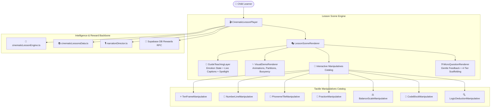

# ORBis — Phase 6 Master Delivery Report
## Cinematic Guided Learning Experience (“Khan Kids–Level Educational Experience, But Unmistakably ORBis”)

---

### 1. Executive Summary

Phase 6 elevates the ORBis Academy lesson experience from structural text blocks into a **cinematic, character-guided, visual-first, and narrated educational adventure**. 

Every lesson now follows the natural child-first cognitive cycle:
$$\text{WELCOME} \rightarrow \text{CHARACTER HOOK} \rightarrow \text{SHOW} \rightarrow \text{EXPLAIN} \rightarrow \text{INTERACT} \rightarrow \text{TRY} \rightarrow \text{MICRO-QUESTION} \rightarrow \text{FEEDBACK} \rightarrow \text{PRACTICE} \rightarrow \text{CELEBRATE} \rightarrow \text{REMEMBER}$$

---

### 2. Architecture & Components Delivered

---

### 3. Core Delivery Details

#### A. Active Pedagogical Guides (`GuideTeachingLayer.tsx`)
- 10 full character profiles (`poly`, `newton`, `lexi`, `beep_0`, `sherlock`, `nova`, `davinci`, `atlas`, `aria`, `harmony`).
- Dynamic reactive emotion states: `neutral`, `curious`, `thinking`, `guiding`, `encouraging`, `celebrating`.
- Live word-by-word synchronized dialogue caption bar and voice audio controls (replay, pause/play, speed).

#### B. Tactile Manipulatives Catalog
1. `TenFrameManipulative.tsx`: Subitizing, grouping by 5, empty slot calculation.
2. `NumberLineManipulative.tsx`: Stepping stone jumps forward (+), backward (-), landing stone verification.
3. `PhonemeTileManipulative.tsx`: CVC runic word assembly with sound synthesis.
4. `LogicDeductionManipulative.tsx`: Clue dossier, suspect candidate testing, and hypothesis elimination.
5. `FractionManipulative.tsx`, `BalanceScaleManipulative.tsx`, `CodeBlockManipulative.tsx`.

#### C. Micro-Questions & 4-Tier Progressive Scaffolding (`MicroQuestionRenderer.tsx`)
- In-flow comprehension checks that emerge naturally from the teaching scene.
- Warm, non-punitive feedback ("Almost! Let us look at the clue together.").
- 4-Tier Scaffolding Drawer with anti-answer leak defense:
  - **Tier 1:** Concept Reminder
  - **Tier 2:** Visual Clue
  - **Tier 3:** Specific Guidance
  - **Tier 4:** Worked Method

#### D. Multimodal Demonstration Lessons (`cinematicLessonsData.ts`)
1. **Pre-K Math:** `lesson_prek_star_counting` (*Counting Star Gems with Poly*)
2. **Kindergarten Phonics:** `lesson_k_runic_phonics` (*Runic Word Sounds with Lexi*)
3. **Grade 1 Math:** `lesson_g1_number_line_jumps` (*Frog Jumps on Stepping Stones with Poly*)
4. **Grade 2 Science:** `lesson_g2_floating_islands` (*Buoyancy & Floating Objects with Newton*)
5. **Grade 3 Grammar:** `lesson_g3_action_verbs` (*Ancient Action Runes with Lexi*)
6. **Grade 4 Computer Science:** `lesson_g4_robot_loops` (*Algorithmic Loops with BEEP-0*)
7. **Grade 5 Critical Thinking:** `lesson_g5_clue_deduction` (*Forensic Evidence Dossier with Sherlock*)
8. **Creativity:** `lesson_creativity_color_alchemy` (*Color Mixing Atelier with DaVinci*)
9. **Music & Rhythm:** `lesson_music_harmonic_beats` (*Rhythm & Tempo with Aria*)
10. **SEL & Empathy:** `lesson_sel_calm_breathing` (*Calm Ocean Waves & Feelings with Harmony*)

---

### 4. Verification & Quality Metrics

| Verification Category | Target | Result | Status |
| :--- | :---: | :---: | :---: |
| **Phase 6 Automated Suite** | 6 Section Tests | 6 / 6 Passed | ✅ **100% PASS** |
| **Master Test Runner (`run_all_tests.ts`)** | **57 Test Suites** | **57 / 57 Suites Passed** | ✅ **100% PASS** |
| **TypeScript Strict Compiler (`tsc -b`)** | Project Codebase | 0 Errors | ✅ **PASS** |
| **ESLint Linter (`npm run lint`)** | 404 Project Files | 0 Errors | ✅ **PASS** |
| **Vite Production Build (`vite build`)** | Production Bundle | Built in 3.02s | ✅ **PASS** |

---

### 5. Preserved Subsystems & Zero-Destructive Verification

- **Flagship Games:** All 10 games preserved and connected via capstone bridge.
- **Story Ecosystem:** Story generator, voice synthesizer, and workspace intact.
- **Child Profiles & Multi-Child System:** Full developmental grade scaling from Pre-K to Grade 5.
- **Economy & Rewards:** Authoritative DB RPC reward dispatcher intact.
