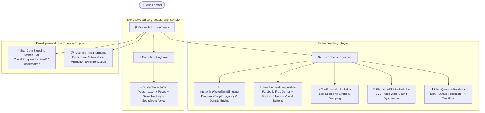

# ORBis — Phase 7 Child Teaching Experience
## Master Teaching Experience & Architectural Elevation Document

---

### 1. Executive Summary

Phase 7 elevates ORBis Academy into an extraordinary, child-first, character-guided, visual-first teaching world. Every lesson adheres to the core cognitive sequence:
$$\text{HOOK} \rightarrow \text{MEET GUIDE} \rightarrow \text{SHOW} \rightarrow \text{EXPLAIN} \rightarrow \text{INTERACT} \rightarrow \text{TRY} \rightarrow \text{MICRO-QUESTION} \rightarrow \text{GENTLE GUIDANCE} \rightarrow \text{CELEBRATE}$$

---

### 2. Architecture & Upgraded Components

---

### 3. Detailed Component Upgrades

#### A. Expressive Guide Character Architecture (`GuideCharacterSvg.tsx`)
- **Dynamic Poses:**
  - `idle_breathe`: Gentle rhythmic floating and bobbing.
  - `pointing_right` / `pointing_left`: Physical arm/wing pointing directly toward target manipulatives.
  - `thinking`: Inquisitive chin pose with ideation lightbulb.
  - `excited_wave`: Warm animated welcoming wave with cosmic sparkles.
  - `celebrating_bounce`: High-energy victory bounce with fanfare particles.
  - `encouraging_nod`: Compassionate supportive tilt on learner retry.
- **Gaze Direction Engine:** Real-time eye pupil offsets (`down` looking at active manipulatives, `left`/`right`, `center`).
- **Synchronized Voice Waves:** Live multi-bar animated soundwave badge indicating active speech.

#### B. Interactive Science Discovery Sandbox (`InteractiveWaterTankSimulator.tsx`)
- Replaces static CSS displays with a dynamic, tactile buoyancy laboratory.
- Children can physically drop objects into the tank:
  - 🪵 **Wooden Log** (Density $0.6$ — Floats and bobs on surface)
  - 🪨 **River Pebble** (Density $2.6$ — Sinks to seabed)
  - 🍾 **Hollow Glass Bottle** (Density $0.3$ — Super buoyant trapped air)
  - 🗝️ **Golden Key** (Density $4.2$ — Heavy brass sinks fast)
  - 🪶 **Soft Feather** (Density $0.1$ — Floats effortlessly)
- Real-time discovery explanation banners and instant water splash sound feedback.

#### C. Visual Stepping Stones & Parabolic Frog Jumps (`NumberLineManipulative.tsx`)
- Replaced text-only buttons with bold, intuitive visual controls:
  - `⬅️ Back (-1)`
  - `Hop Forward (+1) ➔ 🐸`
- Jumping frog avatar (Ribbit) with target stone pulse and tactile card-flip soundscapes.

#### D. Developmental Star Gem Progress Trail (`CinematicLessonPlayer.tsx`)
- For Pre-K and Kindergarten learners who cannot read step text, replaced "Step 1 of 4" with a glowing **Star Gem Stepping Stones Trail** (⭐ $\rightarrow$ ⭐ $\rightarrow$ ⭐ $\rightarrow$ ⭐).
- Active and completed steps illuminate with golden radial glow.

#### E. Teaching Timeline Orchestrator (`teachingTimelineEngine.ts`)
- Declarative event dispatcher synchronizing character entrance, dialogue narration, directional pointing, object highlighting, and tactile touch target unlocking.

---

### 4. Verification & Quality Assurance Results

| Verification Suite | Target / Scope | Result | Status |
| :--- | :---: | :---: | :---: |
| **Phase 7 Child Experience Suite** | 21 Test Assertions | 21 / 21 Passed | ✅ **100% PASS** |
| **Master Test Runner (`run_all_tests.ts`)** | **58 Test Suites** | **58 / 58 Passed** | ✅ **100% PASS** |
| **TypeScript Strict Compiler (`tsc -b`)** | Project Codebase | 0 Errors | ✅ **PASS** |
| **ESLint Linter (`npm run lint`)** | 408 Project Files | 0 Errors | ✅ **PASS** |
| **Vite Production Build (`vite build`)** | Production Client Assets | Built in 3.07s | ✅ **PASS** |

---

### 5. Preserved Systems & Zero-Destructive Verification

- **Flagship Games:** All 10 flagship games preserved intact.
- **Story Generation:** AI story creator, canvas orchestrator, and voice synthesizer intact.
- **Child Profiles & Auth:** Grade scaling, PIN modal, and parent zone settings preserved.
- **Economy:** Authoritative database RPC rewards dispatched upon lesson victory.
