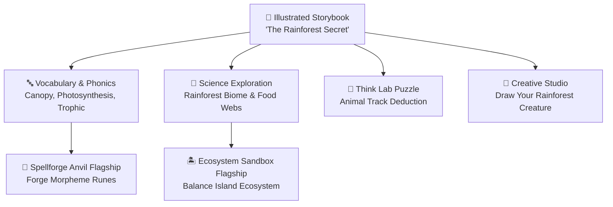

# ORBis Story & Learning Integration Specification
**Date:** August 29, 2026  
**Version:** 1.0.0  

---

## 1. The Unified Story $\leftrightarrow$ Learn $\leftrightarrow$ Play Ecosystem

Stories in ORBis are deeply connected to academic curriculum, critical thinking labs, and flagship games.

---

## 2. Reading Experience Modes

1. **Read to Me:** Automated synchronized narration with word-by-word karaoke highlighting, sound effects, and ambient background music.
2. **Read by Myself:** Child reads at their own pace; tapping any unfamiliar word provides instant phonetic pronunciation and a child-friendly definition.
3. **Interactive Storybook:** Embedded comprehension questions, prediction prompts (*"What do you think happens next?"*), and interactive scene objects.
