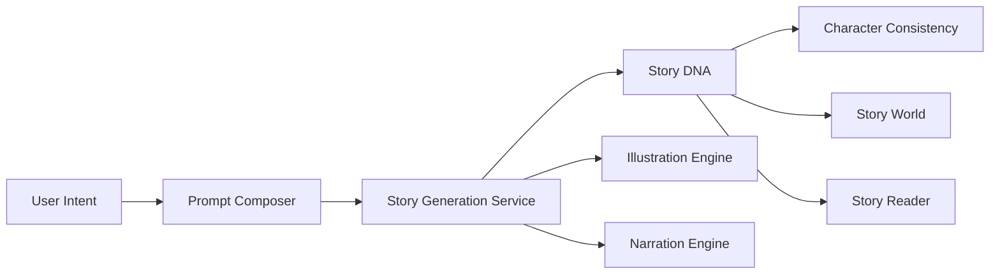

# System Overview

WonderTalesAI is organized around a storytelling pipeline that transforms a simple user request into a complete, child-friendly reading experience.

## High-Level Flow

## Story Generation Flow

The story generation experience begins with user input such as topic, age group, genre, moral lesson, and reading length. This input is passed through the prompt composer, which builds a structured instruction set for the generation model.

Once the model returns a story draft, the system validates and enriches it using domain-specific rules. The result is then transformed into a usable story package with narrative content, educational structure, and presentation metadata.

## Story DNA

Story DNA is the semantic backbone of a generated story. It captures the essential identity of the tale, including:

- theme
- age-appropriate reading level
- moral or educational lesson
- vocabulary targets
- emotional tone
- narrative pacing

This layer allows the system to keep stories consistent and reusable across different experiences such as reading, narration, and illustration.

## Character Consistency

Character consistency ensures that recurring characters remain recognizable across chapters or story variants. The system uses stable character attributes such as name, personality, role, appearance hints, and voice style.

This is especially important for longer story arcs, where the model may otherwise drift in tone or behavior.

## Story World

The story world describes the setting, context, and atmosphere of the story. It may include:

- environment details
- cultural references
- objects and landmarks
- recurring motifs
- visual style cues

The story world helps maintain coherence between the narrative and any downstream visual or audio experiences.

## Prompt Composer

The prompt composer is responsible for assembling detailed, structured prompts for the generation services. It translates product intent into model-ready instructions while balancing:

- safety constraints
- educational goals
- tone and age appropriateness
- narrative quality requirements
- style and length settings

This component is central because most downstream quality depends on the quality of the initial request.

## Illustration Engine

The illustration engine converts story content into visual concepts. It generates prompts, selects image providers, and produces artwork that supports the story experience. This engine is designed to be provider-agnostic so that image generation can evolve over time without changing the broader product flow.

## Narration Engine

The narration engine produces spoken versions of the story. It may support different voice styles, pacing, and language options. The goal is to make the reading experience more immersive while supporting accessibility and engagement for children.

## Story Reader

The story reader is the presentation layer that brings all generated assets together. It renders the story content, optional narration controls, illustrations, and reading structure in a user-friendly interface. The reader is the point where the underlying generation services become a polished experience for the end user.

## Architectural Intent

The current architecture prioritizes:

- modular services
- clear separation between generation and presentation
- future extensibility for new providers and media formats
- child-safe, educational storytelling workflows
