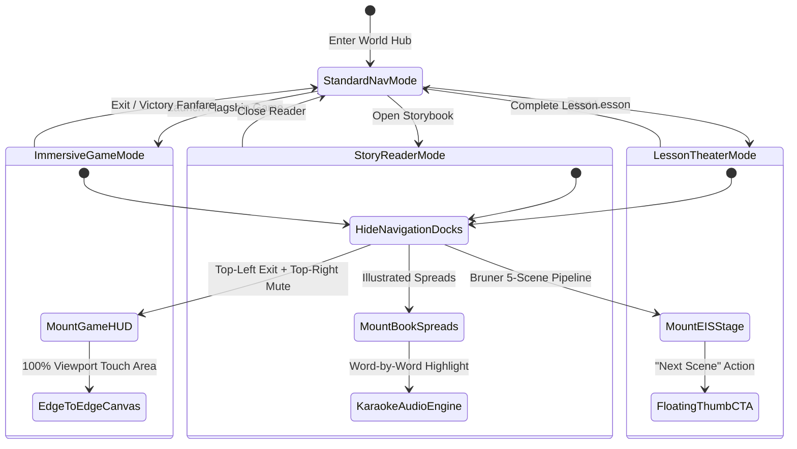

# ORBis Master Architecture & Product Canon
**Document Version:** 1.0.0 (Phase 0.5 Canonization)  
**Status:** Canonical & Approved  
**Platform Target:** Google Play Store (Android) & Apple App Store (iOS) via Capacitor Native Packaging

---

## 1. Product Vision & Universe Identity

**ORBis is a mobile-first children’s creative learning universe.**

It is **NOT**:
- A conventional desktop SaaS dashboard.
- A static desktop educational website.
- Merely an AI prompt story generator.
- A standard Learning Management System (LMS).
- A loose collection of unrelated web minigames.

ORBis integrates personalized AI storytelling, structured multi-realm academic curricula, tactile physics and logic simulations, continuous cognitive mastery tracking, and living companion habitats into a **single, immersive, living cosmic world**.

---

## 2. The Four-World Cosmic Architecture

The primary child experience is strictly structured around **Four Canonical Worlds**:

```
                                    ORBIS COSMIC UNIVERSE
                                              │
         ┌────────────────────────────────────┼────────────────────────────────────┐
         │                                    │                                    │
   [1. OVERWORLD]                       [2. ACADEMY]                         [3. STORIES]                         [4. PLAYROOM]
   The Living Cosmic                    The Structured                       Personalized AI Story                10 Flagship Procedural
   Journey & Missions                   Learning Realms                      Studio & Reader                      Physics & Logic Games
         │                                    │                                    │                                    │
   ┌─────┴───────────────┐              ┌─────┴───────────────┐              ┌─────┴───────────────┐              ┌─────┴───────────────┐
   │ • Journey Map Trail │              │ • 10 Realm Citadels │              │ • 4-Step Generator  │              │ • 10 Simulation Labs│
   │ • Daily Missions    │              │ • 348 Skill Crystals│              │ • Karaoke Reader    │              │ • Mulberry32 PRNG   │
   │ • Stardust Unlocks  │              │ • Bruner EIS Lessons│              │ • Bilingual Audio   │              │ • Wonder Dossiers   │
   │ • Activity Recom.   │              │ • Practice Arenas   │              │ • Cross-World Links │              │ • Tactile HUD Mode  │
   └─────────────────────┘              └─────────────────────┘              └─────────────────────┘              └─────────────────────┘
                                              │
                        ┌─────────────────────┴─────────────────────┐
                        │                                           │
               [SANCTUARY & PASSPORT]                              [PARENT ZONE]
               (Secondary Explorer Meta)                           (Protected Adult Suite)
               ├── Living Creature Nursery                         ├── 4-Digit Security PIN Gate
               ├── Habitat Feeding & Bonding                       ├── Screen-Time & Bedtime Curfews
               ├── Cognitive Brain Skill Radar                     ├── Cognitive Growth Reporting
               └── Science Codex & Badges                          └── PDF Achievement Diplomas
```

### World 1: The Overworld (Cosmic Exploration & Daily Journey)
- **Role:** The child's daily starting hub and overarching narrative compass.
- **Core Mechanics:** Biome trail progression (Canopy, Valley, Woods, Hills, Citadel), daily stardust bounties, milestone unlocking, and cross-world activity recommendations based on cognitive skill balance.

### World 2: The Academy (Structured Curriculum & Guided Mastery)
- **Role:** The formal learning citadel containing 10 Subject Realms, 48 Expeditions (Courses), and 348 Competency Skills.
- **Core Mechanics:** Guided Bruner Enactive-Iconic-Symbolic (EIS) 5-stage lessons, 13 interactive practice evaluators, and pedagogical mentorship by Realm Guides.

### World 3: Story Studio (Personalized Imagination & Illustrated Reader)
- **Role:** AI-powered personalized story creation and multi-sensory reading studio.
- **Core Mechanics:** 4-step story creation wizard, real-time generation with ambient stardust overlays, word-level audio karaoke read-along highlighting, multi-language translation, and Story-to-Academy continuity bridges.

### World 4: The Playroom (Experimentation & Flagship Games)
- **Role:** Hands-on tactile laboratory featuring 10 flagship procedural physics and cognitive simulations.
- **Core Mechanics:** Mulberry32 deterministic seeded PRNG challenges, real-time 2D physics rigs, alchemy balance mechanics, algorithmic grid navigation, and unlocked Science of Wonder dossiers.

### Secondary Explorer Meta Systems
- **The Sanctuary:** Personal creature nursery for hatching, feeding, petting, and bonding with starlight beasts discovered in Creature Lab.
- **The Explorer Passport:** The child's mastery identity containing the 5-domain Cognitive Brain Radar, unlocked Science Dossiers, and crystal achievement badges.

### Protected Adult System
- **The Parent Zone:** A secure suite gated behind a 4-digit PIN (`ParentPinModal`) containing multi-child profile management, screen-time curfews, bedtime wind-down timers, cognitive domain balance analytics, and printable PDF diplomas.

---

## 3. Canonical Navigation Model

Navigation follows a strict two-tier hierarchy designed for touchscreens:

```
┌─────────────────────────────────────────────────────────────────────────┐
│ TOP EXPLORER BAR (Universal Status Header)                              │
│ [ Child Avatar + Lvl ]  [ 🌟 Stardust / Stars ]  [ 🔇 SFX ]  [ 🛡️ Parent ]│
├─────────────────────────────────────────────────────────────────────────┤
│                                                                         │
│                         PRIMARY LIVING STAGE VIEW                       │
│                     (Overworld / Academy / Stories / Playroom)          │
│                                                                         │
├─────────────────────────────────────────────────────────────────────────┤
│ BOTTOM EXPLORER DOCK (4 Primary Worlds Only)                            │
│ [ 🗺️ Overworld ]    [ 🏛️ Academy ]    [ 📖 Stories ]    [ 🪐 Playroom ]   │
└─────────────────────────────────────────────────────────────────────────┘
```

1. **Top Explorer Bar:** Houses persistent child identity, level badges, live currency counters (Stardust/Stars), master audio toggles, and secure Parent Zone access.
2. **Bottom Explorer Dock:** Exclusively provides one-tap switching between the **Four Canonical Worlds**.
3. **No Bottom Dock Clutter:** Sanctuary and Passport remain accessible via the Top Bar Avatar chip and Overworld milestone nodes. They are never dumped onto the primary bottom dock.
4. **Dynamic Immersive Hiding:** When entering any active game, lesson, or story reader, both top and bottom navigation bars hide automatically.

---

## 4. Canonical Home Definition

- **The Canonical Home for Authenticated Children is `/overworld`.**
- Upon opening the app with an active child profile, the application immediately presents the Overworld Journey Map.
- The public root `/` serves strictly as the initial marketing splash / welcome gate for unauthenticated or first-launch users and is never used as an in-app child hub.

---

## 5. Canonical Target Route Tree

```
/                                      -> Public Splash & Welcome Entry
/onboarding                            -> First-Launch Onboarding Wizard
/auth                                  -> Parent Authentication & Recovery

/* THE 4 PRIMARY WORLDS */
/overworld                             -> OverworldPage (Canonical Child Home / World 1)
/academy                               -> AcademyHomePage (World 2: Learning Realms Hub)
/academy/realm/:subjectId              -> SubjectDetailPage (Realm Citadel)
/academy/expedition/:courseId          -> CourseDetailPage (Course Expedition Path)
/academy/skill/:skillId                -> SkillHubPage (Skill Competency Hub)
/academy/lesson/:lessonId              -> LessonPage (Immersive Bruner EIS Player)
/academy/practice/:practiceSetId       -> PracticePage (Immersive Practice Arena)

/stories                               -> StoryLibraryPage (World 3: Story Vault)
/stories/create                        -> CreateStoryPage (4-Step Creative Wizard)
/stories/read/:storyId                 -> StoryWorkspacePage (Immersive Story Reader)

/playroom                              -> GameUniversePage (World 4: 10 Flagship Games Hub)
/playroom/game/:gameId                 -> FlagshipGamePage (Immersive Game Station HUD)

/* SECONDARY EXPLORER META */
/sanctuary                             -> SanctuaryPage (Living Creature Habitat)
/passport                              -> PassportPage (Cognitive Skill Radar & Codex)

/* PROTECTED PARENT INTELLIGENCE */
/parent                                -> ParentZonePage (Intelligence Dashboard)
/parent/profiles                       -> ChildProfileManagementPage
/parent/curfew                         -> ScreenTimeCurfewPage
/parent/settings                       -> AppSettingsPage
```

> **Migration Requirement (Phase B):** The 17 legacy alias routes (`/games/*`, `/playroom/*`, `/playground/*`, `/library`, `/workspace`, `/dashboard`, `/adventure-passport`, `/settings`) must be redirected to the canonical routes and scheduled for deprecation.

---

## 6. The Immersive Theater Principle

Interactive games, cinematic lessons, and story reading are **full-screen immersive experiences**, not standard web pages.



### Immersive Theater Specifications
- **Edge-to-Edge Canvas:** Canvas and interaction viewports occupy 100% of the screen within device safe-area insets.
- **Minimal HUD Overlay:** Includes only an Exit/Back button (with accidental-tap confirmation for active sessions) and a Sound Toggle.
- **Zero Bottom Dock / Orby Obstruction:** Standard navigation docks and floating companion widgets are completely unmounted during gameplay and reading.

---

## 7. Character Canon: Orby vs The 10 Realm Guides

```
+-------------------------------------------------------------------------------------------------------+
| CHARACTER            | PRODUCT ROLE                   | LOCATION / APPEARANCE   | AUDIO IDENTITY      |
+-------------------------------------------------------------------------------------------------------+
| Orby the Sprite      | Universal Assistant &          | Top Explorer Bar Chip / | Warm Chimes & Short |
|                      | Global System Navigator        | Modal Helper (Not fixed)| Spoken Hints        |
+-------------------------------------------------------------------------------------------------------+
| Poly the Owl         | Mathematics Realm Mentor       | Math Lessons & Scales   | Analytical & Wise   |
| Newton the Otter     | Science & Physics Mentor       | Science & Magic Machine | Enthusiastic & Fun  |
| Lexi the Fox         | English & Phonics Mentor       | Spellforge & Stories    | Playful & Articulate|
| Beep-0 the Automaton | Computer Science & Logic Mentor| RoboPath & Algorithms   | Rhythmic Electronic |
| Aria the Songbird    | Reading & Phonics Mentor       | Story Reader & Rhymes   | Melodic & Gentle    |
| Nova the Sprite      | Astronomy & Space Mentor       | Constellations & Overw. | Sparkling & Wonder  |
| Sherlock the Hound   | Mystery & Deduction Mentor     | Mystery Detective Lab   | Thoughtful & Keen   |
| Atlas the Bear       | History & Geography Mentor     | Ecosystems & World Lore | Grounded & Warm     |
| Jade the Lynx        | Visual Arts & Creativity Mentor| Creature Lab & Art Hub  | Creative & Curious  |
| Terra the Golem      | Earth Science & Biology Mentor | Sanctuary & Habitats    | Deep & Nurturing    |
+-------------------------------------------------------------------------------------------------------+
```

### Character Invariants
1. **Orby is NOT an 11th Academic Guide:** Orby manages global system navigation, streak rewards, and accessibility guidance.
2. **Pedagogical Authority Belongs to Realm Guides:** Lessons and game stations are led exclusively by their designated Realm Guide.
3. **No Persistent Floating Collisions:** `OrbyCompanion.tsx` must never float persistently over interactive game canvases or bottom thumb-zone CTAs.

---

## 8. Curriculum Fallback Architecture: Zero Dead Ends

### The Problem
- The curriculum registry defines **348 skills**.
- `cinematicLessonsData.ts` contains **10 bespoke cinematic lessons**.
- **338 skills currently lack bespoke lessons**, causing `LessonPage.tsx:47` to display a raw `"Lesson not found"` error.

### The Canonical Fallback Solution
```
                         Child Taps Curriculum Skill
                                     │
                 ┌───────────────────┴───────────────────┐
                 │                                       │
      Bespoke Lesson Exists?                    No Bespoke Lesson
     (cinematicLessonsData.ts)                           │
                 │                                       ▼
                 ▼                       Dynamic Adaptive Practice Generator
       CinematicLessonPlayer             (Curriculum Skill Metadata +
     (5-Scene Bruner EIS Player)          13 Interactive Practice Evaluators)
                 │                                       │
                 │                                       ▼
                 │                       Interactive Scaffolded Session
                 │                       (Concept Card -> Interactive
                 │                        Manipulative -> Immediate Feedback)
                 │                                       │
                 └───────────────────┬───────────────────┘
                                     │
                                     ▼
                           Mastery Reward Cascade
                      (+30 XP, +5 Stars, Badges Earned)
```

1. **Zero Dead Ends:** Every skill in the registry must remain playable.
2. **Dynamic Generation:** If a bespoke lesson is missing, the system dynamically renders an interactive practice session using `practiceEngine.ts`, the skill's cognitive metadata, and matching digital manipulatives.
3. **Full Economy Integration:** Completing a fallback session grants standard XP, Stardust, and mastery progression via `masteryService.ts` and `economyService.ts`.

---

## 9. Game Architecture & Canonical Registry

### Authoritative Game Registry
The canonical procedural game registry is strictly **`src/services/games/gameRegistry.ts`**.

```
+---------------------------------------------------------------------------------------------------+
| GAME ID                 | CANONICAL ENGINE             | CANONICAL ROUTE           | STATUS       |
+---------------------------------------------------------------------------------------------------+
| creature_alchemist      | creatureLabEngine.ts         | /playroom/game/creature-lab| Modern PRNG  |
| clockwork_physics       | magicMachineEngine.ts        | /playroom/game/magic-machine| Modern PRNG |
| midnight_detective      | mysteryDetectiveEngine.ts    | /playroom/game/detective   | Modern PRNG  |
| apothecary_scales       | potionScalesEngine.ts        | /playroom/game/potion-scales| Modern PRNG |
| spellforge_anvil        | spellforgeEngine.ts          | /playroom/game/spellforge  | Modern PRNG  |
| memory_museum           | memoryMuseumEngine.ts        | /playroom/game/memory-museum| Modern PRNG |
| rhythm_conductor        | rhythmSpellsEngine.ts        | /playroom/game/rhythm-spells| Modern PRNG |
| robopath_academy        | roboPathEngine.ts            | /playroom/game/robopath    | Modern PRNG  |
| ecosystem_sandbox       | ecosystemSandboxEngine.ts    | /playroom/game/ecosystem   | Modern PRNG  |
| cosmic_constellation    | cosmicConstellationEngine.ts | /playroom/game/constellation| Modern PRNG |
+---------------------------------------------------------------------------------------------------+
```

- All 10 engines use deterministic Mulberry32 PRNG seeded generators.
- The legacy `playgroundRegistry.ts` (which relies on system emojis) is scheduled for deprecation and replacement.

---

## 10. Story Studio Architecture

```
┌─────────────────┐     ┌──────────────────┐     ┌─────────────────┐     ┌──────────────────┐
│  1. Selection   │ ──> │  2. Generation   │ ──> │   3. Reading    │ ──> │  4. Continuity   │
│  Child Profile, │     │  Gemini AI Edge  │     │  Word-by-Word   │     │  Unlock Related  │
│  Hero, & World  │     │  Pipeline with   │     │  Audio Karaoke  │     │  Playroom Games  │
│  Presets        │     │  Stardust Overlay│     │  & Translation  │     │  & Academy XP    │
└─────────────────┘     └──────────────────┘     └─────────────────┘     └──────────────────┘
```

### Security & Production Hygiene Invariants
1. **Server-Side API Keys:** Gemini API keys must remain strictly on server-side Supabase Edge Functions. Client code must never contain direct API secrets.
2. **Zero Developer Leakage:** Developer debug controls (*"Test Gemini API Connection"*, *"ORBIS AI Diagnostic Output"*) must be completely removed from user-facing reading views.

---

## 11. Shell Architecture: Universal Shell & Ambient Backdrop

```
                                    UniversalPageShell
                                            │
                     ┌──────────────────────┴──────────────────────┐
                     │                                             │
      CosmicAtmosphereBackdrop                            Stage Content Vessel
      (Shared WebGL/Canvas Particle System +              (Responsive Safe-Area Padded View)
       Dynamic Nebula Atmosphere Shifts)                           │
                                             ┌─────────────────────┴─────────────────────┐
                                             │                                           │
                                     STANDARD APP MODE                           IMMERSIVE THEATER MODE
                                     (Overworld, Academy, Hubs)                  (Games, Lessons, Story Reader)
                                     ├── TopExplorerBar                          ├── Minimal Overlay HUD
                                     ├── Living World Content                    ├── Edge-to-Edge Canvas
                                     └── BottomExplorerDock                      └── Floating Exit/Pause CTA
```

- **`UniversalPageShell.tsx`:** Standardizes safe-area insets, ambient background mounting, audio lifecycle hooks, and modal dialog layers.
- **`CosmicAtmosphereBackdrop.tsx`:** Consolidates all background particle rendering into a single, high-performance, shared 60fps canvas, eliminating redundant per-page `<ParticleField>` instances.

---

## 12. Mobile-First & Store Packaging Canon

### Touch & Safe Area Principles
- **Touch Target Baselines:** Minimum 44px for secondary controls; minimum 56px for primary child action buttons.
- **Safe Area Inset Handling:** Strict consumption of `env(safe-area-inset-top)` and `env(safe-area-inset-bottom)` to protect against notches, Dynamic Islands, and gesture bars.
- **Responsive Viewport Brackets:**
  - **320px–360px:** Single-column stacked cards, compact text scaling.
  - **375px–430px:** Full-width thumb-zone interaction docks.
  - **768px+ (Tablet):** Multi-column spatial layout grids.

---

## 13. Design System & Legacy Debt Canon

### Visual Language Invariants
- **Aesthetic Tone:** Cosmic, playful, tactile, clean, and premium.
- **Typography:** **Outfit** (Display/Headings) and **Inter** (Body/UI).
- **Iconography:** Pure vector SVG iconography via `AnimatedIcon.tsx` and bespoke design tokens. **Zero unstyled Unicode emojis in primary navigation or UI cards.**
- **Legacy CSS Pruning:** Progressive migration away from the 127KB `src/App.css` towards modular component styles and CSS tokens (`tokens.css`, `academyTokens.ts`).

---

## 14. Accessibility & Early Reader Canon

- **Spoken Audio Prompts:** Spoken guidance for key navigation hubs and menu choices to empower Pre-K and early readers (ages 3–5).
- **Reduced Motion:** Automatic disabling of particle emitters, floating transforms, and complex springs when `prefers-reduced-motion: reduce` is detected.
- **Dyslexia Support:** Selectable high-legibility / OpenDyslexic typography modes within `StoryBookViewer`.
- **RTL & Internationalization:** Full RTL layout support (`dir="rtl"`) with locale persistence via `I18nContext.tsx`.

---

## 15. Security & Data Ownership Canon

```
User Authentication (Supabase Auth / Guest Fallback)
         │
         ▼
Parent Account Record (profiles table)
         │
         ├── Gated by 4-Digit Security PIN (ParentPinModal)
         │
         ▼
Child Profiles (child_profiles table)
         │
         ├── Isolated Activity Records (activity_records table)
         ├── Mastery Progress (mastery_progress table)
         └── Generated Stories (stories table, RLS enforced)
```

- **Row Level Security (RLS):** All story, profile, and progress database operations are strictly scoped to authenticated parent accounts via PostgreSQL RLS policies.

---

## 16. Sacred Engineering Invariants (Do Not Touch)

The following 13 systems are **strictly protected** and must not be deleted or rewritten:
1. `src/services/academy/curriculum/curriculumRegistry.ts`
2. `src/services/academy/curriculum/cinematicLessonsData.ts`
3. All 10 flagship game engines under `src/services/games/*Engine.ts`
4. `src/services/academy/masteryService.ts`
5. `src/hooks/useActivityEconomy.ts`
6. `src/services/economyService.ts`
7. Supabase database migrations and RLS policies
8. `src/services/authService.ts`
9. `src/context/AuthContext.tsx`
10. `src/services/childProfileService.ts`
11. `src/hooks/useChildProfiles.ts`
12. `src/services/audio/narrationDirector.ts`
13. `src/services/audio/sfxService.ts`

---

## 17. Dependency-Ordered Implementation Roadmap

```
PHASE A: Core Design Tokens, Layout Shells & SVG Iconography
   │ (UniversalPageShell, CosmicAtmosphereBackdrop, Outfit/Inter fonts, Emoji cleanup)
   ▼
PHASE B: Navigation Consolidation & 4-World Unification
   │ (Unify routes, TopExplorerBar, BottomExplorerDock, deprecate 17 alias routes)
   ▼
PHASE C: Immersive Mobile Game & Lesson Theater Viewports
   │ (Full-bleed game HUDs, safe-area insets, remove floating Orby widget)
   ▼
PHASE D: Adaptive Curriculum Practice Fallback Engine
   │ (Zero dead-ends for 338 skills via practiceEngine integration)
   ▼
PHASE E: First-Launch Onboarding & Profile Setup Flow
   │ (Age/grade calibration, avatar forge, parent onboarding wizard)
   ▼
PHASE F: Native Mobile Packaging (iOS & Android Hardening)
   │ (Capacitor iOS workspace initialization, native gestures, store compliance)
```

---

## 18. Phase A Scope & Boundaries

### Phase A Exact Scope
1. Implement `src/components/layout/UniversalPageShell.tsx`.
2. Implement `src/components/ui/design/CosmicAtmosphereBackdrop.tsx`.
3. Update `index.html` to load Google Fonts for **Outfit** and **Inter**, and update metadata.
4. Refactor `MobileBottomNav.tsx` to display the 4 canonical worlds using `AnimatedIcon` SVGs.
5. Refactor `TopExplorerBar.tsx` and `Header.tsx` to replace system emojis with bespoke SVGs.
6. Remove developer debug tools tab (*"Test Gemini API Connection"*) from `StoryWorkspacePage.tsx`.
7. Move conditional `useMemo` hooks before early returns in `CourseDetailPage.tsx`.

### Phase A Do-Not-Touch List
- **DO NOT TOUCH** any of the 13 Sacred Invariants.
- **DO NOT TOUCH** game physics engines or PRNG math.
- **DO NOT TOUCH** curriculum datasets or lesson script arrays.
- **DO NOT TOUCH** Supabase migrations or RLS rules.

---

## 19. Open Product Decisions (Awaiting User Confirmation)

1. **Authenticated Child Default Landing:** Confirm that when a child profile is active, the app opens directly to **Overworld (`/overworld`)**.
2. **Orby Floating Widget Behavior:** Confirm that `OrbyCompanion.tsx` is removed as a fixed floating overlay across game/lesson viewports.
3. **Sanctuary & Passport Navigation Placement:** Confirm that Sanctuary and Passport are accessed via the Top Bar Avatar chip and Overworld nodes, leaving the Bottom Dock dedicated to the 4 Primary Worlds.

---

## 20. Verified Phase 0.5 Repository Audit Findings

- **Routing:** 36 lazy routes and 17 alias/duplicate routes exist in `AppRouter.tsx`.
- **Shell Structure:** `AppShell.tsx` unconditionally wraps all pages with `<Header>`, `<OrbyCompanion>`, `<Footer>`, and `<MobileBottomNav>`.
- **Curriculum:** 10 Realms, 48 Courses, 348 Skills in `curriculumRegistry.ts`; exactly 10 bespoke lessons in `cinematicLessonsData.ts`; 338 skills lack bespoke lessons and trigger `"Lesson not found"`.
- **Game Engines:** 10 deterministic procedural physics engines exist in `src/services/games/*Engine.ts`. Competing legacy registry in `playgroundRegistry.ts`.
- **Audio Engine:** `sfxService.ts` synthesizes 47 sound cues using pure Web Audio API oscillators with zero network overhead.
- **Styling Debt:** `src/App.css` is a 127KB / 6,526-line monolithic stylesheet.
- **Build Performance:** Production bundle builds in 18.14s; initial bundle size is 139.06 kB gzipped (within 150 kB budget).
- **Native State:** `android/` workspace exists; `ios/` workspace is not initialized.
