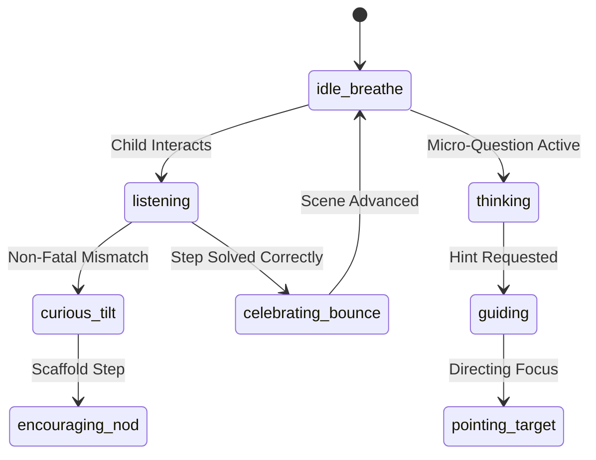

# ORBis Character Bible & Guide Actor Specification

> **Standard:** Characters as Pedagogical Actors (NOT Static Decorative Mascots)  
> **Core Rule:** Characters observe the child's interaction, express nuanced emotions, direct visual gaze, and adapt teaching strategies based on real learner state.

---

## 1. The 10 Guide Personalities

```
┌──────────────┬──────────────────┬──────────────────────┬───────────────────────────────┐
│ Guide ID     │ Persona          │ Academic Domain      │ Teaching Style & Voice        │
├──────────────┼──────────────────┼──────────────────────┼───────────────────────────────┤
│ poly         │ Geometric Owl    │ Math & Logic         │ Socratic, curious, methodical │
│ newton       │ River Otter      │ Science & Physics    │ Enthusiastic, hands-on, bubbly│
│ lexi         │ Story Fox        │ Reading & Vocabulary │ Warm, lyrical, expressive     │
│ beep_0       │ Clockwork Robot  │ Computer Science     │ Quirky, logical, encouraging  │
│ aria         │ Songbird         │ Music & Rhythm       │ Melodic, upbeat, rhythmic     │
│ nova         │ Star Sprite      │ Astronomy & Space    │ Wonder-filled, cosmic, gentle │
│ sherlock     │ Hound Detective  │ Deduction & Puzzles  │ Observant, forensic, patient  │
│ atlas        │ Mountain Bear    │ Geography & Earth    │ Grounded, adventurous, sturdy │
│ jade         │ Forest Lynx      │ Ecology & Plants     │ Attentive, nurturing, calm    │
│ terra        │ Mineral Golem    │ Geology & Materials  │ Steady, tactile, reassuring   │
└──────────────┴──────────────────┴──────────────────────┴───────────────────────────────┘
```

---

## 2. Character State Engine & Emotional Poses

Every character in ORBis supports 12 responsive actor states:



### Pose Matrix:
1. `idle_breathe`: Gentle continuous subtle vertical float with soft blinking.
2. `listening`: Ears perk up, eyes track active pointer/cursor position.
3. `thinking`: Head tilts $6^\circ$, hand/wing touches chin, gaze drifts upward.
4. `curious_tilt`: Head tilts $8^\circ$ with wide eyes when an unexpected response occurs.
5. `guiding`: Open posture, warm smile, gesturing towards interactive canvas.
6. `pointing_right` / `pointing_left`: Directional arm/wing extension towards target manipulative.
7. `encouraging_nod`: Soft downward nod, affirming the child's effort.
8. `excited_wave`: Hand wave with energetic aura pulse.
9. `surprised_sparkle`: Eyes widen with tiny stardust particles when a new concept unlocks.
10. `celebrating_bounce`: Vertical jump with $1.08\times$ scale burst and golden aura.
11. `confused_gentle`: Soft blink and tilt when multiple mistakes occur, transitioning to remediation.
12. `demonstrating`: Active manipulation pose during direct visual demonstration scenes.

---

## 3. Real-Time Learner Reactive Behaviors

* **Immediate Success:** Guide transitions to `celebrating_bounce`, delivers a crisp affirmation ("Spot on, Explorer!"), and nods encouragingly.
* **First Misconception:** Guide transitions to `curious_tilt` $\to$ `thinking`, followed by Level 1 attention cue ("Hmm, take a close look at the columns!").
* **Repeated Hesitation (Idle > 12s):** Guide gently coughs or waves (`excited_wave`), providing a supportive nudge without penalty ("Need a hint? Tap me anytime!").
* **Repeated Misconceptions ($\ge 2$):** Guide steps closer to the canvas, transitions to `guiding`, and highlights the exact row or part needed to unblock progress.
