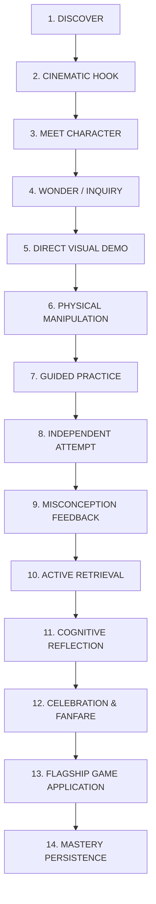

# ORBis Premium Experience Master Specification

> **Status:** Canonical Architecture & Design Authority  
> **Standard:** International Benchmark for Children's Digital Learning Universe

---

## 1. The Gold Standard Lesson Architecture

The canonical benchmark lesson is **`lesson_g2_array_multiplication`** ("Array Alchemy & Multiplication"). Every lesson in ORBis must follow this 14-stage pedagogical production model:

### Stage-by-Stage Breakdown for `lesson_g2_array_multiplication`:

1. **Discover (Contextual Trigger):**  
   The child arrives from the celestial map into the *Citadel of Stars*. Poly the Owl notices the child's progress and initiates an alchemical challenge.
2. **Cinematic Hook (Narrative Anchor):**  
   "Hoo-hoo! The Star Alchemist needs to plant 12 glowing stardust crystals into a magical garden. But if we plant them one by one, it takes too long!"
3. **Meet Character & Wonder:**  
   Poly exhibits an inquisitive head tilt (`curious_tilt`), blinking with expressive gaze tracking. "How can we organize them in tidy rows so we can count them in a flash?"
4. **Direct Visual Demonstration (Mayer's Modality & Signaling):**  
   12 star seeds float onto the screen. They naturally group into 3 equal clusters of 4. Poly gestures with his wing, and the 3 clusters glide into 3 horizontal rows of 4 columns. A glowing bounding box highlights each row: "$4 + 4 + 4 = 12$".
5. **Physical Manipulation (Concrete Representation):**  
   The child is handed an interactive Star Array Grid. The child drags star gems into grid slots, physically experiencing the spatial dimension of rows and columns.
6. **Guided Practice (Scaffolded Discovery):**  
   Poly prompts: "Let's make 2 rows of 5 star gems!" The child fills the grid. An ambient harmonic chime sounds upon row completion.
7. **Independent Attempt:**  
   The child solves a dynamic configuration on the Number Line / Array hybrid stage without guide intervention.
8. **Misconception-Aware Diagnostic Feedback:**  
   - *If the child confuses rows and columns:* Poly highlights the horizontal axes in cyan and vertical in amber: "Remember, rows go side-to-side like a sleeping wand, while columns stand tall like pillars!"
   - *If the child miscounts:* Graduated spotlight illuminates each column.
9. **Active Retrieval:**  
   A quick micro-question challenges the child: "If we have 3 rows of 4, what multiplication equation represents our entire garden?" ($3 \times 4 = 12$).
10. **Cognitive Reflection:**  
    Poly summarizes the core conceptual takeaway: "Multiplication is just fast repeated addition of equal groups!"
11. **Celebration & Rewards:**  
    Celestial stardust particle explosion, rewarding $35\text{ XP}$ and $2\text{ Stars}$, minted directly to the authenticated child profile.
12. **Flagship Game Application (Transfer):**  
    A direct portal opens to the *Magic Machine Lab*, where the child uses their newly mastered $3 \times 4$ array to power up the celestial gear engine.
13. **Mastery Persistence:**  
    `masteryService` updates `skill_arrays_multiplication_intro` to $50\%$ baseline mastery and flags it as ready for fluency practice.
